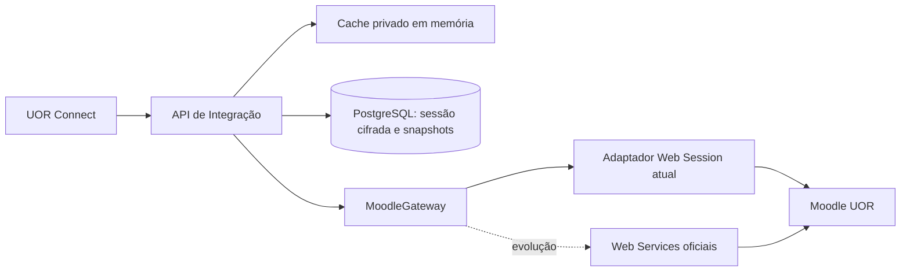

# API Moodle → UOR Connect — Integração Segura e Normalizada

## Estado

- Data: 2026-07-19
- Estado: aprovado para implementação
- Âmbito: backend, persistência, sincronização, contrato OpenAPI/Swagger e testes
- Fonte oficial pedagógica: Moodle da Universidade Óscar Ribas
- Consumidor: UOR Connect

## Contexto

A UOR Connect deve funcionar como camada de integração, sem substituir o Moodle. O frontend não deve conhecer URLs, cookies, tokens, parâmetros, HTML ou estruturas internas do Moodle.

A exploração autenticada confirmou que a conta analisada consegue obter perfil, 29 disciplinas, categorias, datas, progresso quando configurado, secções, materiais, calendário, notificações e contagens de mensagens. Também confirmou que:

- apenas parte das disciplinas possui acompanhamento real de progresso;
- ausência de progresso não pode ser apresentada como `0%`;
- o total global de materiais ainda não é conhecido até todas as disciplinas serem sincronizadas;
- Web Services oficiais existem no Moodle, mas a autorização e emissão de token dependem da administração;
- o contrato OpenAPI existente descreve uma API proposta, não uma implementação já disponível no backend.

## Objetivo

Implementar uma API interna estável que:

- autentique o estudante no Moodle;
- mantenha sessão e credenciais cifradas para reautenticação automática;
- use cache em memória e persistência por estudante;
- sincronize e normalize disciplinas, secções e materiais;
- forneça totais com estado de cobertura explícito;
- esconda completamente detalhes técnicos do Moodle;
- documente apenas respostas úteis, verificadas e sem ruído no Swagger;
- permita substituir futuramente a integração HTML/AJAX por Web Services oficiais sem alterar o contrato público.

## Não objetivos

- Reimplementar ou substituir o Moodle.
- Alterar conteúdos, notas, submissões ou atividades no Moodle nesta fase.
- Tratar dados da Secretaria como se fossem dados Moodle.
- Expor HTML bruto, cookies, `sesskey`, URLs internas, IDs Moodle ou respostas upstream.
- Afirmar que uma contagem é exata antes de concluir a respetiva sincronização.

## Decisão arquitetural

Será usada uma arquitetura híbrida de duas camadas:

1. **L1 em memória:** sessão descifrada por até 5 minutos e promessas de reautenticação em curso, sempre indexadas por `studentId` e geração.
2. **L2 persistente:** sessão, credenciais, snapshots e estado de sincronização no PostgreSQL, com dados sensíveis cifrados.



O backend terá um módulo isolado em `backend/src/modules/moodle`, dividido em domínio, aplicação, infraestrutura e HTTP. As rotas não conhecerão cookies ou seletores HTML; apenas casos de uso e modelos normalizados.

## Estratégias consideradas

### 1. Híbrida portátil — escolhida

Cache em memória, persistência Prisma, AES-256-GCM e lease atómico na base de dados. Funciona em desenvolvimento com SQLite e em produção com PostgreSQL, sem introduzir Redis ou um serviço externo obrigatório.

Vantagens:

- sobrevive a reinícios;
- suporta múltiplas instâncias;
- evita autenticações repetidas;
- adapta-se à infraestrutura atual.

Limite: a chave de cifragem continua disponível ao processo do backend. A cifragem protege especialmente contra exposição isolada da base de dados, mas não resolve um comprometimento completo do servidor.

### 2. KMS e Redis

Usaria um gestor externo de chaves e locks/cache distribuídos. Oferece isolamento e rotação superiores, mas acrescenta infraestrutura, custo e dependências que o projeto ainda não possui.

Esta opção fica como evolução compatível; o envelope cifrado inclui identificador de chave para permitir migração futura.

### 3. Sessão sem credenciais persistidas

Guardaria apenas cookies, exigindo novo login manual quando expirassem. Reduz o impacto de um incidente, mas não cumpre a reautenticação automática aprovada.

## Segurança de credenciais e sessão

### Consentimento e entrada

`POST /integrations/moodle/session` recebe `username`, `password` e confirmação explícita `rememberCredentials: true` através de HTTPS. O frontend deve informar que a ligação será mantida automaticamente. Nesta modalidade aprovada, ausência da confirmação ou valor `false` retorna `422` e nenhum segredo é persistido.

A senha padrão usada durante a análise:

- não será incorporada no código;
- não será adicionada a exemplos, fixtures ou `.env.example`;
- não será reutilizada implicitamente para outras contas.

### Cifragem

Credenciais e sessão serão envelopes separados, cifrados com AES-256-GCM:

```txt
v1.<keyId>.<iv>.<authTag>.<ciphertext>
```

Regras:

- chave de 256 bits fornecida por secret de ambiente;
- IV aleatório de 96 bits, nunca reutilizado;
- AAD com versão, finalidade e `studentId`, impedindo mover ciphertext entre estudantes ou entre campos;
- username e password cifrados no mesmo payload de credenciais;
- cookie jar completo e `sesskey` cifrados no payload de sessão;
- comparação e manipulação apenas dentro do módulo Moodle;
- uso de `Buffer` e limpeza com `fill(0)` quando tecnicamente possível; strings JavaScript não são tratadas como memória zerável;
- tempo de vida do payload descifrado limitado ao pedido ou ao TTL L1 de 5 minutos;
- nenhuma exceção inclui payload sensível.

Configuração prevista:

- `MOODLE_INTEGRATION_ENABLED`;
- `MOODLE_BASE_URL`;
- `MOODLE_FETCH_TIMEOUT_MS`;
- `MOODLE_ACTIVE_ENCRYPTION_KEY_ID`;
- `MOODLE_ENCRYPTION_KEYS`;
- `MOODLE_SESSION_IDLE_TTL_MINUTES`;
- `MOODLE_SYNC_CONCURRENCY`;
- `MOODLE_SYNC_WORKER_ENABLED`.

Defaults iniciais: fetch de 25 segundos, L1 de 5 minutos, concorrência de sync igual a 2 e TTL ocioso de sessão de 30 minutos. `MOODLE_ENCRYPTION_KEYS` usa pares `keyId:base64` separados por vírgula e cada valor descodificado tem exatamente 32 bytes.

Em produção, a integração não inicia se estiver habilitada sem uma chave válida. A chave ativa cifra novos valores. Ao ler um envelope com chave anterior, o repositório volta a cifrá-lo com a chave ativa usando CAS, sem bloquear o pedido. Uma chave desconhecida produz erro operacional `503`, preserva o ciphertext e nunca é apresentada como erro do estudante.

### Proteções HTTP

- autenticação UOR Connect obrigatória;
- pre-handler Moodle consulta a base de dados em cada pedido e exige `deletedAt: null`, `institutionCode: "UOR"` e `isUorStudent: true`;
- acesso exclusivo a `request.student`; júri e treinador são rejeitados mesmo que `authGuard` os aceite genericamente;
- após login Moodle, o número de estudante normalizado do perfil Moodle deve ser idêntico ao `studentNumber` UOR Connect autenticado; mismatch retorna `403` e não persiste qualquer segredo;
- CSRF obrigatório nas mutações autenticadas por cookie, usando a proteção já existente;
- login limitado inicialmente a 5 tentativas por 15 minutos por estudante e IP;
- sync limitado a 3 pedidos por 10 minutos por estudante, reutilizando uma execução já ativa;
- `Cache-Control: private, no-store` em todas as respostas personalizadas;
- redirecionamentos e URLs upstream limitados ao `MOODLE_BASE_URL` permitido;
- timeouts, tamanho máximo de resposta e tipo de conteúdo validados;
- nunca seguir redirecionamentos para hosts externos;
- propriedade de curso/material revalidada por `studentId` em cada acesso;
- schemas marcam segredos como `writeOnly` e a configuração do logger aplica redaction a `username`, `password`, cookies, `sesskey`, envelopes e headers de autorização.

### Desligar e eliminar

`DELETE /integrations/moodle/session` elimina:

- envelopes de credenciais e sessão;
- entradas L1;
- snapshots Moodle do estudante;
- sincronizações pendentes ou reutilizáveis.

Antes da purga local, a API tenta invalidar a sessão atual no Moodle em best effort, sem reautenticar durante logout; falha upstream não impede a eliminação local. A linha `MoodleConnection` permanece como tombstone sem segredos, com `status = DISCONNECTED` e `connectionGeneration` incrementada. Todo pedido e todo commit de worker compara essa geração, impedindo que trabalho antigo restaure sessão ou snapshots depois do logout.

O projeto usa soft-delete de estudante. Portanto, não se depende apenas de `onDelete: Cascade`: um único serviço de desativação atualiza `Student.deletedAt`, incrementa o tombstone Moodle e purga os dados na mesma transação. Fluxos administrativos, ODIN e scripts existentes, incluindo `backfill-student-institution-code.ts`, são migrados para esse serviço. Um teste de contrato proíbe novos escritores diretos de `deletedAt` fora do serviço/migração explicitamente autorizada. Cada operação Moodle volta a consultar o estudante, bloqueando imediatamente tokens antigos de contas eliminadas. Hard-delete, se algum dia existir, mantém `onDelete: Cascade` como defesa adicional.

Como defesa contra escrita externa ou restore antigo, uma reconciliação a cada 60 segundos procura estudantes `deletedAt != null` com ligação Moodle não tombstonada e executa a purga antes de qualquer sync. O caminho oficial é imediato; o fallback limita desvios externos a no máximo 60 segundos e nenhum endpoint Moodle serve uma conta soft-deleted durante esse intervalo.

O logout remove dados da base ativa. Backups globais PostgreSQL podem conservar apenas ciphertext até expirarem segundo a política geral de backup; as chaves ficam fora desses backups. Um restore deve executar a reconciliação de soft-deletes/tombstones antes de habilitar o worker Moodle. Não haverá auditoria, export ou backup específico com credenciais em texto simples.

## Estados da ligação

Estados públicos:

- `DISCONNECTED`: não existem credenciais utilizáveis;
- `CONNECTED`: sessão confirmada;
- `CONNECTING`: primeira ligação ou substituição de credenciais em curso;
- `REFRESHING`: uma instância está a renovar a sessão;
- `REAUTH_REQUIRED`: credenciais rejeitadas, captcha/MFA ou reautenticação automática bloqueada;
- `DEGRADED`: sessão existe, mas o Moodle está temporariamente indisponível.

Configuração inválida, chave ausente e ciphertext ilegível são estado operacional `UNAVAILABLE`, retornam `503` e pedem contacto com suporte, não novo login. Toda resposta de estado inclui `actionRequired`, `retryable`, `lastAuthenticatedAt` e `lastSuccessfulSyncAt`, com valores anuláveis quando ainda não existem.

## Fluxo de autenticação

### Primeira ligação

1. Validar estudante UOR e body.
2. Criar/obter a linha de controlo antes de qualquer chamada upstream; por CAS, marcar `CONNECTING`, incrementar `connectionGeneration` e guardar `connectionAttemptId`/lease.
3. Obter página de login e `logintoken`.
4. Autenticar no Moodle usando um cookie jar isolado.
5. Confirmar sucesso por uma página autenticada e obter identidade Moodle.
6. Comparar o número de estudante do perfil Moodle com a identidade UOR Connect autenticada.
7. Cifrar credenciais e sessão em envelopes diferentes.
8. Persistir segredos apenas por CAS de `studentId + connectionGeneration + connectionAttemptId + CONNECTING`; zero linhas significa que logout/reconnect venceu e o resultado é descartado.
9. Incrementar `sessionVersion`, preencher L1 e iniciar sincronização inicial.
10. Retornar apenas estado normalizado e identificadores UOR Connect.

O cookie jar serializado preserva `name`, `value`, `domain`, `path`, `expires`, `secure`, `httpOnly` e `sameSite`. O gateway só aceita domínios iguais ao host Moodle configurado e só envia cookies compatíveis com domínio/path/HTTPS. `sessionExpiresAt` é uma estimativa de cache; uma resposta autenticada válida continua a ser a prova de sessão.

Número Moodle ausente ou impossível de normalizar é incompatibilidade upstream `502` e não persiste segredo. Número válido mas diferente do estudante autenticado retorna `403`. A primeira ligação retorna `201`; substituição de credenciais numa ligação existente retorna `200`. Ambas retornam `initialSyncRunId` e estado seguro. Outro POST enquanto `CONNECTING` retorna `409`; não inicia login paralelo. `DELETE /session` é idempotente e retorna `200`, mesmo quando já desligado, e sempre incrementa a geração antes de limpar L1.

### Pedido normal

1. Procurar sessão válida no L1.
2. Na ausência, carregar e descifrar a sessão persistida.
3. Executar a chamada Moodle.
4. Se o Moodle devolver login/expiração, iniciar renovação automática.
5. Repetir no máximo uma vez com a nova `sessionVersion`.

### Renovação automática e atómica

Dentro de uma instância, um `single-flight` por `studentId` faz pedidos concorrentes aguardarem a mesma Promise.

Entre instâncias, `MoodleConnection` terá `reauthLeaseOwner`, `reauthLeaseUntil`, `connectionGeneration` e `sessionVersion`. A aquisição será feita por atualização condicional atómica usando hora da base de dados e owner UUID único:

- apenas uma instância adquire lease ausente ou expirado;
- a vencedora descifra credenciais e autentica;
- grava a nova sessão apenas se ainda possuir o lease e as gerações observadas;
- incrementa `sessionVersion` e liberta o lease;
- autenticação completa possui budget de 60 segundos; cada fetch usa o menor valor entre 25 segundos e o budget restante;
- lease de reautenticação dura 90 segundos e recebe heartbeat CAS a cada 15 segundos;
- as restantes instâncias aguardam/poll até 65 segundos, observam a nova versão e reutilizam a sessão; ao exceder retornam `503` retryable com `Retry-After`;
- leases sem heartbeat expiram e podem ser recuperados;
- cada operação lê a linha de controlo antes de reutilizar L1, tornando logout/soft-delete visíveis entre instâncias;
- a implementação PostgreSQL usa CAS com `UPDATE ... WHERE generation/version/lease ... RETURNING`; SQLite usa equivalente transacional apenas para desenvolvimento e testes locais.

Após falha de credenciais:

- incrementar `failedReauthCount`;
- aplicar cooldown de 1, 5 e 15 minutos;
- depois de três falhas, marcar `REAUTH_REQUIRED`;
- não repetir automaticamente até o estudante fornecer novas credenciais;
- um novo `POST /session` substitui os envelopes e reinicia o contador.

Captcha, MFA ou alteração incompatível no login também resultam em `REAUTH_REQUIRED`, nunca em tentativa infinita. Relógio, espera e geração de UUID são injetáveis nos testes.

## Modelo de persistência

### `MoodleConnection`

Uma ligação por estudante:

- `id` interno;
- `studentId` único;
- `status`;
- `moodleUserId` interno, nunca exposto;
- `credentialsEnvelope`;
- `sessionEnvelope`;
- `connectionGeneration`;
- `sessionVersion`;
- `activeSnapshotVersion`;
- `activeSyncRunId`;
- `connectionAttemptId` e respetivo lease;
- `sessionExpiresAt` estimado;
- `reauthLeaseOwner` e `reauthLeaseUntil`;
- `failedReauthCount` e `nextReauthAt`;
- `lastAuthenticatedAt`, `lastUsedAt`, `lastErrorCode`;
- timestamps.

### `MoodleEntityRef` e versões

IDs públicos são UUID aleatórios persistidos, nunca ID Moodle codificado, contador sequencial público ou HMAC curto. `MoodleEntityRef` guarda `studentId`, `kind`, chave Moodle interna e `publicId`, com unicidade `(studentId, kind, moodleExternalKey)` e `(studentId, publicId)`. Cursos, secções e materiais referenciam esta identidade estável; todos os lookups públicos usam `(studentId, publicId)`.

Cada linha de snapshot contém `snapshotVersion` e `syncRunId`. A ligação aponta para uma única `activeSnapshotVersion`; GETs nunca misturam versões.

### `MoodleCourseSnapshot`

- ID público opaco e estável gerado pela UOR Connect;
- `studentId` e ID Moodle interno;
- nome, nome curto, categoria e visibilidade;
- datas de início/fim;
- `progressAvailable` e `progressPercent` anulável;
- `syncedAt` e hash normalizado;
- unicidade por estudante, ID Moodle e versão do snapshot.

### `MoodleSectionSnapshot`

- ID público opaco e estável;
- estudante, disciplina e ID interno Moodle;
- posição, título, resumo em texto normalizado e visibilidade;
- `syncedAt`.

### `MoodleMaterialSnapshot`

- ID público opaco e estável;
- estudante, disciplina, secção e ID interno Moodle;
- tipo, título, descrição limpa, disponibilidade e metadados do ficheiro;
- locator Moodle canónico cifrado, composto por tipo e identificadores/path permitido, nunca URL arbitrária fornecida pelo cliente;
- `syncedAt`.

### `MoodleSyncRun`

- ID público;
- `studentId`;
- estado `QUEUED | RUNNING | COMPLETED | PARTIAL | FAILED | CANCELLED`;
- motivo, início/fim, tentativas e lease;
- cursos descobertos, processados, falhados e total de materiais;
- cursor/checkpoint para recuperação.

O run também guarda `connectionGeneration` observada, `snapshotVersion` de staging, `leaseOwner`, `leaseUntil` e heartbeat. Um worker antigo só publica se geração, owner e versão ainda corresponderem.

Todas as tabelas personalizadas são indexadas por `studentId`; nenhuma consulta Moodle usa cache global ou um ID público sem filtrar o proprietário.

## Sincronização

`POST /integrations/moodle/sync` cria ou reutiliza uma execução e retorna `202`. Se já existir run ativo compatível, retorna o mesmo `runId` com `reused: true`; isso é idempotência, não erro `409`. A fila é durável e usa lease na base de dados, evitando sincronizações duplicadas do mesmo estudante.

A exclusão é garantida por `MoodleConnection.activeSyncRunId`. O caso de uso cria um candidato e tenta associá-lo por CAS dentro da transação usando `connectionGeneration`; apenas o candidato associado é autoritativo. Um candidato que perde a corrida fica `CANCELLED` e a resposta reutiliza o run já associado. Finalização/libertação do ponteiro também exige o mesmo `runId` e geração. O agendamento automático por leitura stale chama exatamente este caso de uso, sem caminho paralelo “check then create”.

Pipeline:

1. validar/renovar sessão;
2. sincronizar perfil Moodle;
3. obter a lista completa de disciplinas;
4. para cada disciplina, obter detalhe, secções e materiais;
5. normalizar e gravar cada disciplina na versão de staging numa transação;
6. calcular cobertura e totais;
7. publicar numa transação trocando `activeSnapshotVersion`, apenas se `connectionGeneration` e lease ainda forem válidos;
8. manter a versão anterior por 15 minutos para cursores em curso e depois limpar apenas registos comprovadamente removidos por uma leitura completa.

Um run parcial copia para staging o último dado válido de cada disciplina falhada, quando existir, marcado com `stale: true` e o seu `sourceSyncedAt`. Nesse caso as contagens dependentes permanecem `partial`; nunca se tornam `exact` pela simples presença de linhas antigas.

Regras operacionais:

- concorrência upstream padrão 2, configurável entre 1 e 4;
- timeout padrão de 25 segundos por chamada; backoff de 1, 2 e 4 segundos com jitter de até 250 ms;
- no máximo uma reautenticação por etapa expirada;
- falha numa disciplina preserva o último snapshot válido dessa disciplina e marca-o como stale;
- GETs públicos leem a base de dados e nunca fazem fan-out síncrono por 29 disciplinas;
- uma sincronização interrompida pode continuar a partir do checkpoint;
- a API é somente leitura no Moodle nesta fase.

O worker embutido inicia e termina com o lifecycle Fastify quando `MOODLE_SYNC_WORKER_ENABLED=true`: poll a cada 2 segundos, lease de 60 segundos, heartbeat a cada 20 segundos, reclaim após expiração e graceful shutdown máximo de 30 segundos. Produção executa teste de integração PostgreSQL para o CAS/lease e gera também `schema.deploy.prisma`; testes SQLite não são prova suficiente da garantia multi-instância.

## Normalização e qualidade dos dados

### Contagens

Toda contagem derivada usa:

```json
{
  "value": 29,
  "status": "exact"
}
```

Estados permitidos:

- `exact`: todo o universo foi processado no mesmo snapshot;
- `partial`: existe cobertura incompleta;
- `not_synced`: a sincronização ainda não produziu o dado;
- `unsupported`: a origem atual não fornece o dado com fiabilidade.

Contagem desconhecida usa `value: null`, nunca zero. A resposta inclui cobertura, por exemplo:

```json
{
  "processedCourses": 8,
  "totalCourses": 29,
  "failedCourses": 1
}
```

### Progresso

- `progressAvailable: false` implica `progressPercent: null`;
- `progressPercent: 0` só é válido quando o Moodle confirma acompanhamento e zero progresso;
- resumos e detalhes usam schemas diferentes;
- cursos sem configuração de conclusão não afetam médias de progresso acompanhado.

### Conteúdo

- no MVP, HTML Moodle é sempre convertido para texto limpo; não existe subconjunto HTML público por definir;
- menus, navegação, scripts, acessibilidade repetitiva e conteúdo institucional periférico são descartados;
- secções retornam módulos resumidos, não `string[]` ambíguos;
- nenhum modelo público contém `sourceUrl`;
- materiais retornam `openAvailable` e `downloadAvailable`; tipos sem proxy seguro no MVP retornam ambos como `false`;
- ficheiros permitidos são transmitidos por proxy/stream UOR; a API nunca devolve `Location` Moodle nem HTML Moodle bruto.

`/materials/{materialId}/open` reconstrói o alvo a partir do locator persistido e da base fixa. Cada hop exige HTTPS, host exato Moodle, path allowlist e no máximo três redirects same-origin. O cliente nunca fornece uma URL. O proxy usa backpressure, suporta `Range` quando o upstream suporta, aplica limite padrão de 100 MiB e timeout de 60 segundos.

No MVP, todo ficheiro é download, nunca conteúdo inline: `Content-Disposition: attachment`, filename sanitizado, `X-Content-Type-Options: nosniff` e `Content-Security-Policy: sandbox; default-src 'none'`. `Set-Cookie` e headers upstream não permitidos são descartados. MIME e extensão têm de coincidir com uma allowlist passiva explícita: PDF, TXT, PNG, JPEG, GIF, WebP, MP3, MP4 e formatos Office Open XML sem macro (`docx`, `xlsx`, `pptx`). HTML, SVG, XML, JavaScript, executáveis, formatos macro-enabled e MIME desconhecido retornam `415`; páginas e fóruns ficam `openAvailable: false`. Produção deve preferir um domínio de downloads sem cookies; se for usado o domínio da API, estas regras de attachment/allowlist/sandbox são obrigatórias.

## Contrato HTTP do MVP

Prefixo interno Fastify: `/integrations/moodle`.

O gateway público acrescenta `/api`; os paths OpenAPI não duplicam esse prefixo.

| Método | Path | Resultado |
| --- | --- | --- |
| `POST` | `/session` | autentica, cifra e liga a conta Moodle |
| `DELETE` | `/session` | elimina ligação, segredos e snapshots |
| `GET` | `/me` | identidade Moodle normalizada e estado da ligação |
| `GET` | `/overview` | contagens, cobertura, progresso acompanhado e próximos dados úteis |
| `GET` | `/courses` | disciplinas paginadas |
| `GET` | `/courses/{courseId}` | detalhe de disciplina pertencente ao estudante |
| `GET` | `/courses/{courseId}/sections` | secções e módulos resumidos |
| `GET` | `/courses/{courseId}/materials` | materiais da disciplina |
| `GET` | `/materials` | índice agregado de materiais sincronizados |
| `GET` | `/materials/{materialId}/open` | abertura/stream controlado após validar propriedade |
| `POST` | `/sync` | cria sincronização durável e retorna `202` |
| `GET` | `/sync/status` | última execução, progresso, cobertura e staleness |

Atividades, trabalhos, quizzes, calendário, deadlines, notificações e mensagens continuam documentados como fase seguinte até terem adapter, modelo, testes e resposta real. O contrato não os marcará como implementados antecipadamente.

## Envelopes, paginação e erros

Listas usam cursor, sem misturar paginação por página. O cursor inclui `keyId` e é assinado com HMAC-SHA-256 usando chave derivada por HKDF da respetiva chave do keyring; contém `snapshotVersion`, sort key e UUID público. A ordenação é estável por campo normalizado mais UUID. Cursor adulterado retorna `400`; versão já expirada retorna `409 SNAPSHOT_CHANGED`:

```json
{
  "data": [],
  "meta": {
    "syncedAt": "2026-07-19T12:00:00.000Z",
    "stale": false,
    "pagination": {
      "returned": 0,
      "limit": 20,
      "hasMore": false,
      "nextCursor": null,
      "total": 0,
      "totalStatus": "exact"
    }
  }
}
```

Erros Moodle têm código estável, mensagem segura, `retryable` e ação requerida. Mapeamento mínimo:

- `401`: exclusivamente JWT/cookie UOR Connect ausente ou inválido;
- `403`: estudante não elegível;
- `404`: recurso inexistente ou não pertencente ao estudante;
- `409`: `MOODLE_CONNECTION_REQUIRED`, `MOODLE_REAUTH_REQUIRED`, snapshot/cursor expirado ou outro conflito de estado não reutilizável;
- `415`: tipo de material não permitido para proxy seguro;
- `422`: credenciais Moodle rejeitadas no `POST /session` ou body semanticamente inválido; mismatch confirmado de identidade retorna `403`;
- `429`: limite de autenticação/sincronização;
- `502`: resposta Moodle inválida ou incompatível;
- `503`: Moodle indisponível/timeout ou integração mal configurada.

Cookies, HTML, stack traces, seletores e URLs upstream nunca entram na resposta.

## Swagger/OpenAPI

O contrato será atualizado para OpenAPI 3 com:

- paths `/integrations/moodle/...`;
- servidores diretos e via gateway, incluindo backend local `:3333` e frontend local `:8082/api`;
- autenticação Bearer ou cookie; CSRF documentado nas mutações por cookie;
- `username` e `password` com `writeOnly: true`, sem exemplos reais;
- Swagger Try it out recomenda Bearer; cookie cross-origin exige `withCredentials` e CSRF obtido pela aplicação, não é simulado como autenticação simples;
- exemplos 2xx anonimizados e semanticamente reais;
- exemplos de lista vazia válida e contagem parcial;
- `progressAvailable: false` com progresso `null`;
- IDs opacos e ausência de URLs Moodle;
- `x-implementation-status` (`planned` ou `implemented`);
- `x-source-status` (`observed`, `partially-observed`, `derived` ou `requires-admin`);
- `x-phase`, `x-cache-ttl`, `x-read-only` e `x-requires-moodle-admin`.

Uma operação só muda para `implemented` quando:

1. a rota está registada;
2. o gateway real está ligado no composition root; fixtures contam apenas como suporte de teste;
3. autenticação e ownership são verificados;
4. a resposta passa pelo schema Zod;
5. existem testes de sucesso, sessão expirada e resposta upstream inválida;
6. existe teste automático de paridade rota/handler real/OpenAPI;
7. o Swagger Try it out está configurado para o serviço correto, com smoke real opcional quando secrets autorizados estiverem disponíveis.

Validar YAML isoladamente não é critério de implementação.

## Cache

- L1 guarda apenas sessões descifradas por até 5 minutos e single-flights em curso, sempre por `studentId` e `connectionGeneration`; respostas normalizadas não usam L1 no MVP.
- L2 guarda snapshots normalizados persistentes.
- nenhuma resposta pessoal é cacheável por proxy ou browser compartilhado;
- cada resposta informa `syncedAt` e `stale`;
- overview/lista de cursos ficam fresh por 10 minutos; secções/materiais por 30 minutos;
- dados stale podem ser servidos quando o Moodle está indisponível, com `stale: true`, `syncedAt` e cobertura explícitos;
- leitura stale agenda sync em background se não houver run ativo; nunca bloqueia o GET com fan-out upstream;
- TTLs podem ser alterados por configuração, mantendo estes defaults documentados.

## Observabilidade e auditoria

Serão registados apenas eventos seguros:

- ligação criada/removida;
- autenticação ou reautenticação bem-sucedida/falhada por código;
- sincronização iniciada/concluída/parcial;
- duração, quantidade de cursos e materiais;
- erros por categoria e versão do parser.

Não serão registados username, password, cookies, `sesskey`, URL completa, HTML ou bodies Moodle. Métricas e logs identificam o estudante apenas por ID interno quando necessário e respeitam as políticas de auditoria existentes.

## Estrutura do módulo

```txt
backend/src/modules/moodle/
  domain/
    models.ts
    errors.ts
    gateway.ts
    repository.ts
  application/
    connect-moodle.ts
    disconnect-moodle.ts
    ensure-moodle-session.ts
    get-overview.ts
    list-courses.ts
    list-materials.ts
    run-sync.ts
  infra/
    crypto-envelope.ts
    web-session-moodle.gateway.ts
    moodle-html.parser.ts
    prisma-moodle.repository.ts
    moodle-sync-worker.ts
  http/
    moodle.schemas.ts
    moodle.presenter.ts
    moodle.routes.ts
```

`MoodleGateway` abstrai a fonte. Um futuro `OfficialWebServiceMoodleGateway` poderá substituir o adapter web sem alterar casos de uso ou endpoints.

### Integração com o backend atual

- `AppDependencies` deixa de ser apenas `Record<string, unknown>` para tipar dependências Moodle opcionais de teste e obrigatórias quando a integração está habilitada;
- `registerRoutes` recebe e encaminha essas dependências para `moodleRoutes`;
- o composition root de produção instancia gateway web, repositório Prisma, cifra, cache L1 e worker reais;
- testes substituem interfaces explicitamente, sem alterar o estado `implemented` do contrato;
- `env.ts` valida todos os limites e secrets; `.env.example` contém apenas placeholders;
- `schema.prisma` continua como fonte, e o fluxo PostgreSQL gera/valida `schema.deploy.prisma` antes de deploy;
- alterações de base são aditivas e testadas primeiro em staging; rollback desabilita a feature/worker antes de remover qualquer estrutura.

## Testes obrigatórios

### Unidade

- AES-GCM cifra/descifra e rejeita ciphertext, tag ou AAD adulterados;
- key ID e rotação;
- parser com fixtures anonimizadas;
- deteção de redirect/login expirado;
- normalização remove ruído e URLs;
- progresso indisponível permanece `null`;
- cálculo de totais exatos/parciais.

### Concorrência

- múltiplos pedidos na mesma instância produzem um único login;
- duas instâncias simuladas produzem um único vencedor do lease;
- teste de integração PostgreSQL valida aquisição CAS, heartbeat e reclaim com hora da base;
- lease expirado é recuperado;
- sessão antiga não sobrescreve uma versão nova;
- logout/soft-delete concorrente impede worker ou reauth antigo de recriar dados;
- primeira ligação lenta concorrente com DELETE não consegue persistir depois da mudança de geração;
- reconnect concorrente invalida commits da `connectionGeneration` anterior;
- múltiplos POST sync e GETs stale concorrentes deixam um único `activeSyncRunId`;
- publicação troca uma única `activeSnapshotVersion` e paginação nunca mistura versões;
- máximo de uma repetição upstream por pedido.

### Integração Fastify

- `app.inject` com gateway e repositório injetáveis;
- estudante UOR ativo, estudante soft-deleted, estudante externo, júri e treinador corretamente diferenciados;
- identidade Moodle divergente é rejeitada sem persistir envelopes;
- isolamento completo entre dois estudantes;
- login, logout, overview, paginação e sincronização;
- 401/403/404/409/415/422/429/502/503;
- headers `private, no-store`;
- nenhuma resposta ou log capturado contém segredo ou URL Moodle.
- proxy rejeita HTML/SVG/JS, MIME/extensão divergente e redirect externo; ficheiro permitido é sempre attachment com headers de sandbox.

### Contrato

- OpenAPI válido;
- exemplos 2xx validam contra os schemas;
- paridade entre rotas registadas, gateway real ligado e `implemented`;
- teste de regressão para servidor/prefixo correto;
- cursores assinados e presos à versão do snapshot;
- `prisma:prepare:postgres`, geração do client e teste de lease PostgreSQL no pipeline apropriado;
- smoke test autenticado opcional e fora do CI, usando secrets locais nunca versionados.

## Entrega incremental

1. Fundação: env, cifragem, modelos Prisma, repositório e injeção tipada.
2. Sessão: login web, cookie jar, persistência, L1 e reautenticação atómica.
3. Dados: normalizadores, snapshots, fila de sincronização e cobertura.
4. HTTP: endpoints MVP, ownership, paginação, erros e abertura controlada.
5. Swagger: contrato corrigido, exemplos reais e estados honestos.
6. Verificação: testes unitários, concorrência, integração, build e smoke local.

Cada etapa deve manter o backend compilável. Nenhum teste automatizado depende da conta real usada na exploração.

## Critérios de aceitação

- O backend regista as rotas Moodle sob `/integrations/moodle`.
- A ligação sobrevive a reinício e funciona com mais de uma instância.
- Expiração de cookie provoca uma única reautenticação automática por estudante.
- Credenciais e sessão só existem cifradas na base de dados.
- Três falhas suspendem tentativas automáticas e retornam `REAUTH_REQUIRED`.
- Soft-delete pelo serviço oficial ou logout tornam segredos e snapshots inacessíveis imediatamente e trabalho antigo não os recria; reconciliação cobre escritores externos em até 60 segundos sem permitir leitura da conta eliminada.
- Só é possível ligar uma identidade Moodle cujo número corresponde ao estudante UOR Connect autenticado.
- Um estudante nunca lê dados ou materiais de outro.
- A API retorna o total exato fornecido por um snapshot completo; a fixture auditada com 29 disciplinas retorna 29.
- Materiais só têm total `exact` após cobertura completa; desconhecido nunca vira zero.
- Cursos sem progresso configurado retornam `null`.
- Nenhum JSON ou header público expõe URL, cookie, token, ID interno ou HTML Moodle.
- Download permitido passa pelo proxy com allowlist, limite e ownership; HTML e redirect Moodle são rejeitados.
- Uma lista inteira usa uma única `snapshotVersion`, inclusive durante sincronização concorrente.
- O Swagger contém exemplos úteis e o Try it out aponta para o backend/gateway correto.
- Testes de unidade, integração, contrato, lint e build passam.

## Riscos residuais

- Mudanças no HTML/AJAX do Moodle podem quebrar o adapter web; fixtures, versão do parser e erros `502` tornam a falha visível e contida.
- Captcha ou MFA podem impedir relogin automático e exigirão ação do estudante.
- Cifragem em aplicação não protege contra comprometimento simultâneo do servidor e dos secrets; KMS é a evolução recomendada.
- Sincronizar todas as disciplinas pode pressionar o Moodle; concorrência, TTL, backoff e fila durável limitam o impacto.
- Web Services oficiais continuam a ser a integração preferida quando a administração os habilitar.
