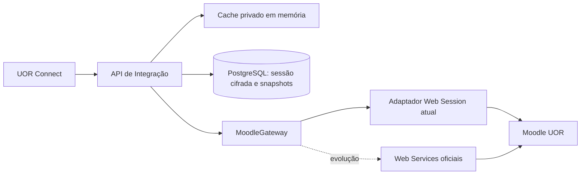

# API Moodle → UOR Connect — Integração Segura e Normalizada

## Estado

- Data: 2026-07-19
- Estado: aprovado para implementação
- Âmbito: backend, persistência, sincronização, contrato OpenAPI/Swagger e testes
- Fonte oficial pedagógica: Moodle da Universidade Óscar Ribas
- Consumidor: UOR Connect

## Contexto

A UOR Connect deve funcionar como camada de integração, sem substituir o Moodle. O frontend não deve conhecer URLs, cookies, tokens, parâmetros, HTML ou estruturas internas do Moodle.

A exploração autenticada confirmou que a conta analisada consegue obter perfil, 29 disciplinas, categorias, datas, progresso quando configurado, secções, materiais, calendário, notificações e contagens de mensagens. Também confirmou que:

- apenas parte das disciplinas possui acompanhamento real de progresso;
- ausência de progresso não pode ser apresentada como `0%`;
- o total global de materiais ainda não é conhecido até todas as disciplinas serem sincronizadas;
- Web Services oficiais existem no Moodle, mas a autorização e emissão de token dependem da administração;
- o contrato OpenAPI existente descreve uma API proposta, não uma implementação já disponível no backend.

## Objetivo

Implementar uma API interna estável que:

- autentique o estudante no Moodle;
- mantenha sessão e credenciais cifradas para reautenticação automática;
- use cache em memória e persistência por estudante;
- sincronize e normalize disciplinas, secções e materiais;
- forneça totais com estado de cobertura explícito;
- esconda completamente detalhes técnicos do Moodle;
- documente apenas respostas úteis, verificadas e sem ruído no Swagger;
- permita substituir futuramente a integração HTML/AJAX por Web Services oficiais sem alterar o contrato público.

## Não objetivos

- Reimplementar ou substituir o Moodle.
- Alterar conteúdos, notas, submissões ou atividades no Moodle nesta fase.
- Tratar dados da Secretaria como se fossem dados Moodle.
- Expor HTML bruto, cookies, `sesskey`, URLs internas, IDs Moodle ou respostas upstream.
- Afirmar que uma contagem é exata antes de concluir a respetiva sincronização.

## Decisão arquitetural

Será usada uma arquitetura híbrida de duas camadas:

1. **L1 em memória:** sessão descifrada por curto período e promessas de reautenticação em curso, sempre indexadas por `studentId`.
2. **L2 persistente:** sessão, credenciais, snapshots e estado de sincronização no PostgreSQL, com dados sensíveis cifrados.



O backend terá um módulo isolado em `backend/src/modules/moodle`, dividido em domínio, aplicação, infraestrutura e HTTP. As rotas não conhecerão cookies ou seletores HTML; apenas casos de uso e modelos normalizados.

## Estratégias consideradas

### 1. Híbrida portátil — escolhida

Cache em memória, persistência Prisma, AES-256-GCM e lease atómico na base de dados. Funciona em desenvolvimento com SQLite e em produção com PostgreSQL, sem introduzir Redis ou um serviço externo obrigatório.

Vantagens:

- sobrevive a reinícios;
- suporta múltiplas instâncias;
- evita autenticações repetidas;
- adapta-se à infraestrutura atual.

Limite: a chave de cifragem continua disponível ao processo do backend. A cifragem protege especialmente contra exposição isolada da base de dados, mas não resolve um comprometimento completo do servidor.

### 2. KMS e Redis

Usaria um gestor externo de chaves e locks/cache distribuídos. Oferece isolamento e rotação superiores, mas acrescenta infraestrutura, custo e dependências que o projeto ainda não possui.

Esta opção fica como evolução compatível; o envelope cifrado inclui identificador de chave para permitir migração futura.

### 3. Sessão sem credenciais persistidas

Guardaria apenas cookies, exigindo novo login manual quando expirassem. Reduz o impacto de um incidente, mas não cumpre a reautenticação automática aprovada.

## Segurança de credenciais e sessão

### Consentimento e entrada

`POST /integrations/moodle/session` recebe `username`, `password` e confirmação explícita `rememberCredentials: true` através de HTTPS. O frontend deve informar que a ligação será mantida automaticamente.

A senha padrão usada durante a análise:

- não será incorporada no código;
- não será adicionada a exemplos, fixtures ou `.env.example`;
- não será reutilizada implicitamente para outras contas.

### Cifragem

Credenciais e sessão serão envelopes separados, cifrados com AES-256-GCM:

```txt
v1.<keyId>.<iv>.<authTag>.<ciphertext>
```

Regras:

- chave de 256 bits fornecida por secret de ambiente;
- IV aleatório de 96 bits, nunca reutilizado;
- AAD com versão, finalidade e `studentId`, impedindo mover ciphertext entre estudantes ou entre campos;
- username e password cifrados no mesmo payload de credenciais;
- cookies e `sesskey` cifrados no payload de sessão;
- comparação e manipulação apenas dentro do módulo Moodle;
- buffers de texto sensível deixam de ser referenciados assim que a operação termina;
- nenhuma exceção inclui payload sensível.

Configuração prevista:

- `MOODLE_INTEGRATION_ENABLED`;
- `MOODLE_BASE_URL`;
- `MOODLE_FETCH_TIMEOUT_MS`;
- `MOODLE_ACTIVE_ENCRYPTION_KEY_ID`;
- `MOODLE_ENCRYPTION_KEYS`;
- `MOODLE_SESSION_IDLE_TTL_MINUTES`;
- `MOODLE_SYNC_CONCURRENCY`.

Em produção, a integração não inicia se estiver habilitada sem uma chave válida. A chave ativa cifra novos valores; chaves anteriores permanecem apenas para descifrar e permitir rotação gradual.

### Proteções HTTP

- autenticação UOR Connect obrigatória;
- acesso exclusivo a `request.student` elegível, ativo e pertencente à UOR;
- CSRF obrigatório nas mutações autenticadas por cookie, usando a proteção já existente;
- rate limit específico para login e sincronização;
- `Cache-Control: private, no-store` em todas as respostas personalizadas;
- redirecionamentos e URLs upstream limitados ao `MOODLE_BASE_URL` permitido;
- timeouts, tamanho máximo de resposta e tipo de conteúdo validados;
- nunca seguir redirecionamentos para hosts externos;
- propriedade de curso/material revalidada por `studentId` em cada acesso.

### Desligar e eliminar

`DELETE /integrations/moodle/session` elimina:

- envelopes de credenciais e sessão;
- entradas L1;
- snapshots Moodle do estudante;
- sincronizações pendentes ou reutilizáveis.

A eliminação da conta UOR Connect também remove estes dados por `onDelete: Cascade`. Uma política de retenção poderá purgar ligações inativas; não haverá cópia de senha em auditoria ou backup lógico específico da integração.

## Estados da ligação

Estados públicos:

- `DISCONNECTED`: não existem credenciais utilizáveis;
- `CONNECTED`: sessão confirmada;
- `REFRESHING`: uma instância está a renovar a sessão;
- `REAUTH_REQUIRED`: credenciais rejeitadas, captcha/MFA, chave ausente ou reautenticação automática bloqueada;
- `DEGRADED`: sessão existe, mas o Moodle está temporariamente indisponível.

O estado público não inclui a razão técnica ou dados upstream. A resposta pode incluir `actionRequired`, `retryable`, `lastAuthenticatedAt` e `lastSuccessfulSyncAt`.

## Fluxo de autenticação

### Primeira ligação

1. Validar estudante UOR e body.
2. Obter página de login e `logintoken`.
3. Autenticar no Moodle usando um cookie jar isolado.
4. Confirmar sucesso por uma página autenticada e obter identidade Moodle.
5. Cifrar credenciais e sessão em envelopes diferentes.
6. Fazer `upsert` de `MoodleConnection`, incrementando `sessionVersion`.
7. Preencher L1 e iniciar sincronização inicial.
8. Retornar apenas estado normalizado e identificadores UOR Connect.

### Pedido normal

1. Procurar sessão válida no L1.
2. Na ausência, carregar e descifrar a sessão persistida.
3. Executar a chamada Moodle.
4. Se o Moodle devolver login/expiração, iniciar renovação automática.
5. Repetir no máximo uma vez com a nova `sessionVersion`.

### Renovação automática e atómica

Dentro de uma instância, um `single-flight` por `studentId` faz pedidos concorrentes aguardarem a mesma Promise.

Entre instâncias, `MoodleConnection` terá `reauthLeaseOwner`, `reauthLeaseUntil` e `sessionVersion`. A aquisição será feita por atualização condicional atómica:

- apenas uma instância adquire lease ausente ou expirado;
- a vencedora descifra credenciais e autentica;
- grava a nova sessão apenas se ainda possuir o lease e a versão observada;
- incrementa `sessionVersion` e liberta o lease;
- as restantes instâncias observam a nova versão e reutilizam a sessão;
- leases abandonados expiram e podem ser recuperados.

Após falha de credenciais:

- incrementar `failedReauthCount`;
- aplicar cooldown exponencial;
- depois de três falhas, marcar `REAUTH_REQUIRED`;
- não repetir automaticamente até o estudante fornecer novas credenciais;
- um novo `POST /session` substitui os envelopes e reinicia o contador.

Captcha, MFA ou alteração incompatível no login também resultam em `REAUTH_REQUIRED`, nunca em tentativa infinita.

## Modelo de persistência

### `MoodleConnection`

Uma ligação por estudante:

- `id` interno;
- `studentId` único;
- `status`;
- `moodleUserId` interno, nunca exposto;
- `credentialsEnvelope`;
- `sessionEnvelope`;
- `sessionVersion`;
- `sessionExpiresAt` estimado;
- `reauthLeaseOwner` e `reauthLeaseUntil`;
- `failedReauthCount` e `nextReauthAt`;
- `lastAuthenticatedAt`, `lastUsedAt`, `lastErrorCode`;
- timestamps.

### `MoodleCourseSnapshot`

- ID público opaco gerado pela UOR Connect;
- `studentId` e ID Moodle interno;
- nome, nome curto, categoria e visibilidade;
- datas de início/fim;
- `progressAvailable` e `progressPercent` anulável;
- `syncedAt` e hash normalizado;
- unicidade por estudante e ID Moodle.

### `MoodleSectionSnapshot`

- ID público opaco;
- estudante, disciplina e ID interno Moodle;
- posição, título, resumo em texto normalizado e visibilidade;
- `syncedAt`.

### `MoodleMaterialSnapshot`

- ID público opaco;
- estudante, disciplina, secção e ID interno Moodle;
- tipo, título, descrição limpa, disponibilidade e metadados do ficheiro;
- destino Moodle interno cifrado para abertura controlada;
- `syncedAt`.

### `MoodleSyncRun`

- ID público;
- `studentId`;
- estado `QUEUED | RUNNING | COMPLETED | PARTIAL | FAILED`;
- motivo, início/fim, tentativas e lease;
- cursos descobertos, processados, falhados e total de materiais;
- cursor/checkpoint para recuperação.

Todas as tabelas personalizadas são indexadas por `studentId`; nenhuma consulta Moodle usa cache global ou um ID público sem filtrar o proprietário.

## Sincronização

`POST /integrations/moodle/sync` cria ou reutiliza uma execução e retorna `202`. A fila é durável e usa lease na base de dados, evitando sincronizações duplicadas do mesmo estudante.

Pipeline:

1. validar/renovar sessão;
2. sincronizar perfil Moodle;
3. obter a lista completa de disciplinas;
4. para cada disciplina, obter detalhe, secções e materiais;
5. normalizar e gravar cada disciplina numa transação;
6. calcular cobertura e totais;
7. publicar snapshot completo ou parcial;
8. limpar apenas registos comprovadamente removidos por uma leitura completa.

Regras operacionais:

- concorrência upstream baixa e configurável;
- timeout e backoff com jitter;
- no máximo uma reautenticação por etapa expirada;
- falha numa disciplina preserva o último snapshot válido dessa disciplina e marca-o como stale;
- GETs públicos leem a base de dados e nunca fazem fan-out síncrono por 29 disciplinas;
- uma sincronização interrompida pode continuar a partir do checkpoint;
- a API é somente leitura no Moodle nesta fase.

## Normalização e qualidade dos dados

### Contagens

Toda contagem derivada usa:

```json
{
  "value": 29,
  "status": "exact"
}
```

Estados permitidos:

- `exact`: todo o universo foi processado no mesmo snapshot;
- `partial`: existe cobertura incompleta;
- `not_synced`: a sincronização ainda não produziu o dado;
- `unsupported`: a origem atual não fornece o dado com fiabilidade.

Contagem desconhecida usa `value: null`, nunca zero. A resposta inclui cobertura, por exemplo:

```json
{
  "processedCourses": 8,
  "totalCourses": 29,
  "failedCourses": 1
}
```

### Progresso

- `progressAvailable: false` implica `progressPercent: null`;
- `progressPercent: 0` só é válido quando o Moodle confirma acompanhamento e zero progresso;
- resumos e detalhes usam schemas diferentes;
- cursos sem configuração de conclusão não afetam médias de progresso acompanhado.

### Conteúdo

- HTML é convertido para texto limpo ou subconjunto sanitizado aprovado;
- menus, navegação, scripts, acessibilidade repetitiva e conteúdo institucional periférico são descartados;
- secções retornam módulos resumidos, não `string[]` ambíguos;
- nenhum modelo público contém `sourceUrl`;
- imagens e ficheiros Moodle são servidos ou redirecionados apenas por endpoint UOR controlado.

## Contrato HTTP do MVP

Prefixo interno Fastify: `/integrations/moodle`.

O gateway público acrescenta `/api`; os paths OpenAPI não duplicam esse prefixo.

| Método | Path | Resultado |
| --- | --- | --- |
| `POST` | `/session` | autentica, cifra e liga a conta Moodle |
| `DELETE` | `/session` | elimina ligação, segredos e snapshots |
| `GET` | `/me` | identidade Moodle normalizada e estado da ligação |
| `GET` | `/overview` | contagens, cobertura, progresso acompanhado e próximos dados úteis |
| `GET` | `/courses` | disciplinas paginadas |
| `GET` | `/courses/{courseId}` | detalhe de disciplina pertencente ao estudante |
| `GET` | `/courses/{courseId}/sections` | secções e módulos resumidos |
| `GET` | `/courses/{courseId}/materials` | materiais da disciplina |
| `GET` | `/materials` | índice agregado de materiais sincronizados |
| `GET` | `/materials/{materialId}/open` | abertura/stream controlado após validar propriedade |
| `POST` | `/sync` | cria sincronização durável e retorna `202` |
| `GET` | `/sync/status` | última execução, progresso, cobertura e staleness |

Atividades, trabalhos, quizzes, calendário, deadlines, notificações e mensagens continuam documentados como fase seguinte até terem adapter, modelo, testes e resposta real. O contrato não os marcará como implementados antecipadamente.

## Envelopes, paginação e erros

Listas usam cursor, sem misturar paginação por página:

```json
{
  "data": [],
  "meta": {
    "syncedAt": "2026-07-19T12:00:00.000Z",
    "stale": false,
    "pagination": {
      "returned": 0,
      "limit": 20,
      "hasMore": false,
      "nextCursor": null,
      "total": 0,
      "totalStatus": "exact"
    }
  }
}
```

Erros Moodle têm código estável, mensagem segura, `retryable` e ação requerida. Mapeamento mínimo:

- `401`: sessão UOR ausente ou `MOODLE_CONNECTION_REQUIRED`/`MOODLE_CREDENTIALS_INVALID` distinguido por código;
- `403`: estudante não elegível;
- `404`: recurso inexistente ou não pertencente ao estudante;
- `409`: sincronização já ativa ou conflito de estado;
- `429`: limite de autenticação/sincronização;
- `502`: resposta Moodle inválida ou incompatível;
- `503`: Moodle indisponível/timeout.

Cookies, HTML, stack traces, seletores e URLs upstream nunca entram na resposta.

## Swagger/OpenAPI

O contrato será atualizado para OpenAPI 3 com:

- paths `/integrations/moodle/...`;
- servidores diretos e via gateway, incluindo backend local `:3333` e frontend local `:8082/api`;
- autenticação Bearer ou cookie; CSRF documentado nas mutações por cookie;
- exemplos 2xx anonimizados e semanticamente reais;
- exemplos de lista vazia válida e contagem parcial;
- `progressAvailable: false` com progresso `null`;
- IDs opacos e ausência de URLs Moodle;
- `x-implementation-status` (`planned` ou `implemented`);
- `x-source-status` (`observed`, `partially-observed`, `derived` ou `requires-admin`);
- `x-phase`, `x-cache-ttl`, `x-read-only` e `x-requires-moodle-admin`.

Uma operação só muda para `implemented` quando:

1. a rota está registada;
2. o adapter real ou fixture equivalente existe;
3. autenticação e ownership são verificados;
4. a resposta passa pelo schema Zod;
5. existem testes de sucesso, sessão expirada e resposta upstream inválida;
6. o Swagger Try it out alcança o serviço correto.

Validar YAML isoladamente não é critério de implementação.

## Cache

- L1 guarda apenas sessões descifradas e resultados muito curtos, sempre por `studentId`.
- L2 guarda snapshots normalizados persistentes.
- nenhuma resposta pessoal é cacheável por proxy ou browser compartilhado;
- cada resposta informa `syncedAt` e `stale`;
- dados stale podem ser servidos quando o Moodle está indisponível, sem os apresentar como atuais;
- TTLs são configuráveis por domínio, não um valor global silencioso.

## Observabilidade e auditoria

Serão registados apenas eventos seguros:

- ligação criada/removida;
- autenticação ou reautenticação bem-sucedida/falhada por código;
- sincronização iniciada/concluída/parcial;
- duração, quantidade de cursos e materiais;
- erros por categoria e versão do parser.

Não serão registados username, password, cookies, `sesskey`, URL completa, HTML ou bodies Moodle. Métricas e logs identificam o estudante apenas por ID interno quando necessário e respeitam as políticas de auditoria existentes.

## Estrutura do módulo

```txt
backend/src/modules/moodle/
  domain/
    models.ts
    errors.ts
    gateway.ts
    repository.ts
  application/
    connect-moodle.ts
    disconnect-moodle.ts
    ensure-moodle-session.ts
    get-overview.ts
    list-courses.ts
    list-materials.ts
    run-sync.ts
  infra/
    crypto-envelope.ts
    web-session-moodle.gateway.ts
    moodle-html.parser.ts
    prisma-moodle.repository.ts
    moodle-sync-worker.ts
  http/
    moodle.schemas.ts
    moodle.presenter.ts
    moodle.routes.ts
```

`MoodleGateway` abstrai a fonte. Um futuro `OfficialWebServiceMoodleGateway` poderá substituir o adapter web sem alterar casos de uso ou endpoints.

## Testes obrigatórios

### Unidade

- AES-GCM cifra/descifra e rejeita ciphertext, tag ou AAD adulterados;
- key ID e rotação;
- parser com fixtures anonimizadas;
- deteção de redirect/login expirado;
- normalização remove ruído e URLs;
- progresso indisponível permanece `null`;
- cálculo de totais exatos/parciais.

### Concorrência

- múltiplos pedidos na mesma instância produzem um único login;
- duas instâncias simuladas produzem um único vencedor do lease;
- lease expirado é recuperado;
- sessão antiga não sobrescreve uma versão nova;
- máximo de uma repetição upstream por pedido.

### Integração Fastify

- `app.inject` com gateway e repositório injetáveis;
- estudante, júri e treinador corretamente diferenciados;
- isolamento completo entre dois estudantes;
- login, logout, overview, paginação e sincronização;
- 401/403/404/409/429/502/503;
- headers `private, no-store`;
- nenhuma resposta contém segredo ou URL Moodle.

### Contrato

- OpenAPI válido;
- exemplos 2xx validam contra os schemas;
- paridade entre rotas registadas e `implemented`;
- teste de regressão para servidor/prefixo correto;
- smoke test autenticado opcional e fora do CI, usando secrets locais nunca versionados.

## Entrega incremental

1. Fundação: env, cifragem, modelos Prisma, repositório e injeção tipada.
2. Sessão: login web, cookie jar, persistência, L1 e reautenticação atómica.
3. Dados: normalizadores, snapshots, fila de sincronização e cobertura.
4. HTTP: endpoints MVP, ownership, paginação, erros e abertura controlada.
5. Swagger: contrato corrigido, exemplos reais e estados honestos.
6. Verificação: testes unitários, concorrência, integração, build e smoke local.

Cada etapa deve manter o backend compilável. Nenhum teste automatizado depende da conta real usada na exploração.

## Critérios de aceitação

- O backend regista as rotas Moodle sob `/integrations/moodle`.
- A ligação sobrevive a reinício e funciona com mais de uma instância.
- Expiração de cookie provoca uma única reautenticação automática por estudante.
- Credenciais e sessão só existem cifradas na base de dados.
- Três falhas suspendem tentativas automáticas e retornam `REAUTH_REQUIRED`.
- Um estudante nunca lê dados ou materiais de outro.
- A API retorna 29 disciplinas quando o snapshot autenticado contém 29.
- Materiais só têm total `exact` após cobertura completa; desconhecido nunca vira zero.
- Cursos sem progresso configurado retornam `null`.
- Nenhum JSON público expõe URL, cookie, token, ID interno ou HTML Moodle.
- O Swagger contém exemplos úteis e o Try it out aponta para o backend/gateway correto.
- Testes de unidade, integração, contrato, lint e build passam.

## Riscos residuais

- Mudanças no HTML/AJAX do Moodle podem quebrar o adapter web; fixtures, versão do parser e erros `502` tornam a falha visível e contida.
- Captcha ou MFA podem impedir relogin automático e exigirão ação do estudante.
- Cifragem em aplicação não protege contra comprometimento simultâneo do servidor e dos secrets; KMS é a evolução recomendada.
- Sincronizar todas as disciplinas pode pressionar o Moodle; concorrência, TTL, backoff e fila durável limitam o impacto.
- Web Services oficiais continuam a ser a integração preferida quando a administração os habilitar.
