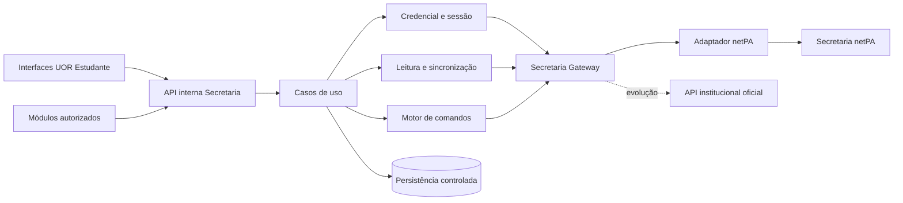

# API Secretaria → UOR Estudante

## 1. Resumo executivo

O backend da UOR Estudante disponibilizará uma API interna e estável para consumo pelas suas interfaces e pelos módulos explicitamente autorizados. A API integrará as capacidades da Secretaria Académica necessárias às funcionalidades aprovadas do produto, sem transformar automaticamente cada página do netPA numa funcionalidade UOR.

O adaptador da Secretaria esconderá URLs, stages, cookies, campos de formulário, HTML e identificadores internos. Os consumidores receberão contratos normalizados, IDs opacos, proveniência, cobertura, frescura e estados verificáveis.

Itens financeiros usam `chargeRef` opaco autenticado por HMAC e rotacionável; o contrato público nunca transporta os três identificadores exigidos pelo wizard netPA.

A primeira entrega aprova a fundação, a persistência controlada da credencial, a sessão, o catálogo de capacidades, a leitura normalizada, os snapshots e a sincronização. Um motor genérico de comandos também faz parte da fundação, mas cada mutação permanecerá desativada até satisfazer autorização, contrato upstream, feature flag, testes e pós-condição próprios.

O âmbito financeiro limita-se a consultar cobranças, gerar ou extrair referências oficiais, apresentá-las ou partilhá-las de forma autorizada, consultar pagamentos já realizados fora do produto e obter recibos permitidos. A UOR Estudante não inicia, executa, cancela ou processa pagamentos e não recebe instrumentos financeiros.

## 2. Produto, autoridade e propriedade

A integração pertence ao produto UOR Estudante. UOR Connect é o nome do ecossistema e permanece proprietária apenas das capacidades transversais definidas no SDD-005, como identidade, autorização, auditoria e consentimento transversal.

Este contrato é subordinado a:

- `SDD-000-ECOSSISTEMA-UOR-CONNECT.md` para visão, fronteiras e vocabulário;
- `SDD-002-UOR-ESTUDANTE.md` para capacidades do produto;
- `SDD-005-CAPACIDADES-TRANSVERSAIS.md` para capacidades transversais;
- `UOR-ESTUDANTE-RF-RNF-REGRAS-NEGOCIO.md` para comportamento verificável;
- ADR-003 para identidade institucional;
- ADR-004 para propriedade dos dados;
- ADR-005 para isolamento de integrações externas.

O netPA é a fonte oficial dos factos académicos, administrativos e financeiros. A UOR Estudante é proprietária das ligações cifradas, IDs públicos, snapshots, sincronizações, comandos, auditoria funcional, preferências e projeções derivadas desta integração.

A API não é apresentada como API pública da Universidade ou de todo o ecossistema. Outros produtos só poderão consumir read models autorizados, nunca as tabelas privadas ou credenciais da integração.

## 3. Evidência e limites de viabilidade

Uma inspeção autenticada e não destrutiva confirmou respostas estruturadas para:

- perfil e boletim de matrícula;
- situação curricular, histórico, totais e regras de progressão;
- anos letivos, períodos, unidades curriculares, inscrições e notas;
- aulas e sumários;
- calendário e lista de exames;
- faltas e presenças;
- situação financeira e pagamentos registados;
- candidaturas existentes;
- formações avançadas e estágios;
- inscrições em épocas de exame;
- pedidos de revisão de nota;
- atividades extracurriculares e competências linguísticas;
- consentimentos;
- diretório público de cursos.

A leitura possui viabilidade alta. A escrita é condicionada porque os formulários, tokens, validações, permissões e pós-condições ainda precisam de ser capturados e testados individualmente.

O upstream observado usa HTTP. Em produção, a integração fica bloqueada até existir HTTPS institucional ou túnel/proxy privado aprovado entre a UOR Estudante e o netPA. O HTTP atual só pode ser usado no ambiente autorizado de desenvolvimento/homologação com configuração explícita.

## 4. Escopo

### 4.1 Escopo aprovado

- configuração segura da integração;
- credencial institucional cifrada e controlada;
- sessões cifradas e renovação autorizada;
- catálogo de capacidades;
- perfil institucional em leitura;
- situação curricular, histórico, inscrições, notas e créditos;
- aulas, sumários, exames, faltas e presenças;
- situação financeira, cobranças e referências;
- histórico oficial de pagamentos e recibos permitidos;
- candidaturas e pedidos de revisão em leitura;
- formações, estágios, atividades e competências em leitura quando necessários ao produto;
- consentimentos em leitura;
- snapshots, proveniência, cobertura e frescura;
- sincronização e fallback `stale` explícito;
- auditoria e observabilidade sem segredos;
- motor genérico de comandos, sem ativação automática das mutações.

### 4.2 Escritas condicionadas

Cada capacidade abaixo é independente e começa `disabled`:

- alterar contactos editáveis;
- atualizar ou remover fotografia;
- atualizar consentimentos disponibilizados pelo portal;
- inscrever ou cancelar inscrição em época de exame;
- preparar ou submeter revisão de nota sem anexos;
- submeter ou alterar candidatura;
- gerir formação avançada;
- gerir estágio;
- gerir atividade extracurricular;
- gerir competência linguística.

Uma escrita só passa a `available` depois de cumprir todos os critérios:

1. necessidade funcional aprovada na UOR Estudante;
2. autorização institucional para automatização;
3. contrato upstream capturado e versionado;
4. fixture anonimizada de preparação, validação, sucesso e permissão;
5. teste de submissão autorizado;
6. pós-condição oficial verificável;
7. idempotência e reconciliação demonstradas;
8. feature flag específica;
9. circuit breaker próprio;
10. teste de ponta a ponta autorizado e evidência na matriz.

A existência de uma rota documentada não significa que a operação esteja ativa.

### 4.3 Fora da primeira versão

- troca da senha institucional dentro da UOR Estudante;
- payment intents, hosted checkout ou redirecionamento para pagamento;
- início, execução ou cancelamento de pagamento;
- receção ou armazenamento de cartão, PIN, CVV ou instrumento financeiro;
- anexos em pedidos de revisão de nota;
- exposição de HTML, cookies, credenciais, stages ou IDs internos;
- reprodução automática de toda função existente no netPA;
- acesso genérico de administradores ou moderadores às credenciais/dados privados;
- automação de CAPTCHA ou contorno de MFA.

Quando o estudante alterar a senha no netPA, a renovação falhará, a ligação passará para `REAUTH_REQUIRED` e as sincronizações/escritas serão suspensas. Uma nova autenticação bem-sucedida substituirá a credencial cifrada anterior.

## 5. Princípios arquiteturais obrigatórios

- adaptador substituível e isolado do domínio;
- contratos normalizados independentes do netPA;
- separação entre sessão, credencial, snapshots e comandos;
- IDs públicos opacos e ownership em todos os acessos;
- credencial e sessão cifradas em envelopes distintos;
- snapshots imutáveis e publicação atómica;
- comandos duráveis, idempotentes e reconciliáveis;
- circuit breaker e feature flag por capacidade;
- auditoria sem segredos;
- testes com fixtures anonimizadas e contratos versionados;
- nenhuma conclusão de sucesso sem pós-condição oficial.

Tecnologias, caminhos físicos, frameworks, cache, persistência e mecanismo de tarefas são decisões técnicas propostas no `ADR-006-ARQUITETURA-TECNICA-INTEGRACAO-SECRETARIA.md`. Não constituem, neste documento, restrição permanente sobre futuras implementações equivalentes.

## 6. Arquitetura lógica

### 6.1 Componentes

- domínio: modelos, estados, erros e invariantes sem dependência do transporte;
- aplicação: ligação, sessão, consultas, sincronização, comandos e reconciliação;
- adaptador: navegação, cookies, AJAX, formulários, parsers e validação upstream;
- persistência: envelopes, snapshots, referências públicas, comandos, evidências e leases;
- HTTP: autenticação, autorização, validação, apresentação e contrato OpenAPI;
- auditoria/observabilidade: eventos funcionais e métricas minimizadas.

Rotas não podem ler credenciais, cookies ou HTML. Apenas o componente autorizado de autenticação pode descodificar a senha institucional.

## 7. Proteção da credencial institucional

### 7.1 Persistência autorizada

A senha pode ser persistida para criar novas sessões, renovar a ligação, executar sincronizações automáticas autorizadas e operações previamente autorizadas. Como precisa de ser reutilizada, será protegida por cifragem reversível autenticada; hash isolado não satisfaz o caso de uso.

Requisitos obrigatórios:

- algoritmo de cifragem autenticada aprovado, inicialmente AES-256-GCM;
- keyring, cofre de segredos ou KMS fora da base de dados;
- envelope de credencial separado do envelope de sessão;
- AAD ligado a versão, finalidade, instituição, estudante e geração;
- senha nunca devolvida ao frontend após a entrada inicial;
- administradores, moderadores, rotas e módulos de negócio sem acesso ao plaintext;
- descodificação exclusiva no autenticador da Secretaria;
- senha em memória somente durante autenticação/renovação e descartada assim que possível;
- credencial nunca mantida em cache descifrado;
- cookies/sessões podem ter cache privado, mas sem senha;
- nenhum log, erro, auditoria, métrica, trace, fixture, teste ou exemplo contém a senha;
- redaction automática de campos sensíveis e proibição de dumps diagnósticos com plaintext;
- core dumps desativados ou protegidos no ambiente operacional;
- cooldown e rate limit após credenciais rejeitadas;
- nova autenticação obrigatória antes de substituir a credencial armazenada;
- invalidação lógica quando o netPA rejeitar a senha;
- eliminação da credencial ao desligar definitivamente a integração;
- rotação sem interrupção, revogação de chave comprometida e inventário por `keyId`;
- acesso às chaves auditado e com privilégio mínimo;
- backups cifrados e separados do domínio de gestão das chaves sempre que possível;
- base de dados e keyring fora do mesmo domínio de comprometimento sempre que possível;
- envelope impossível de serializar acidentalmente numa resposta HTTP.

### 7.2 Estruturas lógicas

`CredentialEnvelope` contém ciphertext, nonce/IV, authentication tag, `keyId`, algoritmo, versão, instituição, estudante, finalidade, geração, criação e rotação.

`SessionEnvelope` contém cookie jar cifrado, `keyId`, geração, expiração estimada e última validação. Não contém a senha.

### 7.3 Fluxo

1. O estudante autenticado fornece número e senha por HTTPS.
2. O backend autentica no netPA.
3. A identidade upstream é comparada com o titular UOR Estudante.
4. Nenhum segredo é persistido se a identidade não coincidir.
5. A senha e a sessão são cifradas em envelopes distintos.
6. O plaintext é descartado assim que tecnicamente possível.
7. Sessões válidas são reutilizadas sem descodificar a senha.
8. Sessão expirada permite descodificação temporária apenas pelo autenticador.
9. A nova sessão substitui a anterior atomicamente.
10. Falhas repetidas levam a `REAUTH_REQUIRED` e suspendem operações.

### 7.4 Condições para produção

A persistência de senha só pode ser ativada em produção depois de existirem análise formal de ameaças, gestão/rotação de chaves, testes de adulteração e rotação, redaction validada, política de retenção/eliminação, resposta a incidentes, controlo de acesso, aprovação institucional e TLS/túnel privado até ao netPA.

A cifragem reduz exposição em repouso, mas não protege contra comprometimento simultâneo do backend e das chaves. A capacidade é classificada como risco crítico.

## 8. Ciclo de vida: sessão, ligação e dados

Os três conceitos são independentes.

### 8.1 Terminar sessão externa

`DELETE /session`:

- invalida/elimina cookies ativos;
- interrompe a sessão atual;
- pode manter a credencial cifrada para reautenticação automática autorizada;
- não elimina snapshots nem histórico importado;
- incrementa a versão da sessão para invalidar caches antigos.

### 8.2 Desligar a integração

`DELETE /connection`:

- elimina cookies e credencial cifrada;
- incrementa a geração da ligação;
- suspende sincronizações;
- cancela comandos ainda não submetidos;
- impede workers antigos de restaurar segredos;
- mantém snapshots segundo a política de retenção.

### 8.3 Eliminar dados importados

`POST /data-deletion-requests`:

- exige autenticação recente, confirmação explícita e apresentação do impacto;
- elimina snapshots e projeções importadas conforme obrigações legais;
- preserva somente registos mínimos obrigatórios de segurança/auditoria;
- não é consequência automática de terminar a sessão ou desligar a integração;
- produz comando auditável e estado consultável.

Soft-delete do estudante executa desligamento imediato e agenda a política de eliminação aplicável.

## 9. Estados da ligação

- `DISCONNECTED`;
- `CONNECTING`;
- `CONNECTED`;
- `REFRESHING`;
- `REAUTH_REQUIRED`;
- `DEGRADED`;
- `UNAVAILABLE`.

Respostas seguras incluem `actionRequired`, `retryable`, `lastAuthenticatedAt`, `lastSuccessfulSyncAt` e cobertura. Não incluem envelopes, cookies, username upstream ou detalhes de parser.

## 10. Catálogo HTTP interno

Base: `/api/v1/integrations/secretaria`.

Todas as rotas personalizadas exigem estudante UOR ativo, ownership, `Cache-Control: private, no-store` e metadados de proveniência/frescura quando aplicáveis.

### 10.1 Integração e ciclo de vida

As tabelas usam `approved_foundation`, `approved_read`, `approved_write_pending_contract`, `conditional_write` e `needs_product_validation` como decisões de escopo. Esses valores não são estados runtime. No catálogo runtime, toda mutação começa `disabled` até ser verificada.

| Método | Rota | Decisão de escopo | Finalidade |
|---|---|---|---|
| GET | `/` | approved_foundation | Estado e versão segura. |
| GET | `/health` | approved_foundation | Saúde operacional sem dados pessoais. |
| GET | `/capabilities` | approved_foundation | Catálogo `available`, `disabled`, `degraded`, `changed` ou `unsupported`. |
| POST | `/session` | approved_foundation | Autenticar e ligar/substituir credencial após identity match. |
| GET | `/session` | approved_foundation | Estado seguro da sessão. |
| DELETE | `/session` | approved_foundation | Terminar apenas a sessão externa. |
| DELETE | `/connection` | approved_foundation | Desligar integração e eliminar segredos. |
| POST | `/data-deletion-requests` | approved_foundation | Eliminar dados importados com step-up e confirmação. |
| GET | `/data-deletion-requests/:id` | approved_foundation | Consultar estado da eliminação. |
| POST | `/sync` | approved_foundation | Iniciar sincronização idempotente. |
| GET | `/sync-runs/:runId` | approved_foundation | Consultar cobertura/estado da execução. |

### 10.2 Perfil e consentimentos

| Método | Rota | Decisão de escopo | Finalidade |
|---|---|---|---|
| GET | `/me` | approved_read | Perfil institucional e mutabilidade por campo. |
| GET | `/me/contact-details` | approved_read | Consultar contactos, moradas e mutabilidade confirmada. |
| PATCH | `/me/contact-details` | approved_write_feature_flagged | Preparar comando de submissão de pedido de alteração; exige `Idempotency-Key`. |
| GET | `/me/photo` | approved_read | Entregar fotografia oficial por proxy autenticado, com ETag e `no-store`. |
| PUT | `/me/photo` | approved_write_feature_flagged | Preparar comando de fotografia JPEG normalizada; exige `Idempotency-Key`. |
| DELETE | `/me/photo` | unsupported | O portal não oferece remoção da fotografia. |
| GET | `/consents` | approved_read | Consultar consentimentos. |
| PATCH | `/consents/:consentId` | conditional_write | Atualizar consentimento permitido. |

Não existe rota de troca de senha na primeira versão.

### 10.3 Académico em leitura

| Método | Rota | Finalidade |
|---|---|---|
| GET | `/academic/overview` | Resumo académico e curricular. |
| GET | `/academic/history` | Histórico curricular. |
| GET | `/academic/enrollments` | Inscrições e unidades curriculares. |
| GET | `/academic/grades` | Notas oficiais. |
| GET | `/academic/credits` | Totais de créditos e cobertura. |
| GET | `/academic/progression-rules` | Regras de progressão/conclusão. |
| GET | `/academic/classes` | Aulas e sumários. |
| GET | `/academic/exams` | Calendário/lista de exames. |
| GET | `/academic/absences` | Faltas. |
| GET | `/academic/attendance` | Presenças. |

### 10.4 Processos e escritas condicionadas

| Método | Rota | Decisão de escopo | Finalidade |
|---|---|---|---|
| GET | `/exam-registrations` | approved_read | Consultar inscrições em épocas. |
| POST | `/exam-registrations` | conditional_write | Inscrever quando capacidade aprovada. |
| DELETE | `/exam-registrations/:registrationRef` | approved_write_feature_flagged | Preparar cancelamento por referência opaca; exige `Idempotency-Key`. |
| GET | `/grade-review-requests` | approved_read | Consultar pedidos de revisão. |
| GET | `/grade-review-requests/:id` | approved_read | Consultar estado/resposta oficial. |
| POST | `/grade-review-requests` | conditional_write | Preparar/submeter revisão sem anexos. |
| GET | `/applications` | approved_read | Consultar candidaturas. |
| POST | `/applications` | conditional_write | Submeter candidatura aprovada. |
| PATCH | `/applications/:id` | conditional_write | Alterar enquanto editável. |
| GET | `/advanced-training` | needs_product_validation | Consultar formações necessárias ao produto. |
| POST | `/advanced-training` | conditional_write | Registar quando aprovado. |
| PATCH | `/advanced-training/:id` | conditional_write | Alterar quando aprovado. |
| DELETE | `/advanced-training/:id` | conditional_write | Remover quando aprovado. |
| GET | `/internships` | needs_product_validation | Consultar estágios necessários ao produto. |
| POST | `/internships` | conditional_write | Inscrever quando aprovado. |
| DELETE | `/internships/:id` | conditional_write | Cancelar quando aprovado. |
| GET | `/extracurricular-activities` | needs_product_validation | Consultar atividades necessárias. |
| POST | `/extracurricular-activities` | conditional_write | Registar quando aprovado. |
| PATCH | `/extracurricular-activities/:id` | conditional_write | Alterar quando aprovado. |
| DELETE | `/extracurricular-activities/:id` | conditional_write | Remover quando aprovado. |
| GET | `/language-competencies` | needs_product_validation | Consultar competências necessárias. |
| POST | `/language-competencies` | conditional_write | Registar quando aprovado. |
| PATCH | `/language-competencies/:id` | conditional_write | Alterar quando aprovado. |
| DELETE | `/language-competencies/:id` | conditional_write | Remover quando aprovado. |

`needs_product_validation` exige confirmação de necessidade funcional, mas não a descoberta de uma nova tecnologia.

### 10.5 Finanças e referências

| Método | Rota | Decisão de escopo | Finalidade |
|---|---|---|---|
| GET | `/finance/overview` | approved_read | Resumo oficial. |
| GET | `/finance/charges` | approved_read | Cobranças, vencimentos, moeda e estado. |
| GET | `/finance/payment-references` | approved_read | Referências existentes. |
| POST | `/finance/payment-references` | approved_write_feature_flagged | Preparar comando para gerar/extrair referência oficial; exige `Idempotency-Key`. |
| POST | `/finance/payment-references/:id/share-requests` | approved_write_pending_contract | Partilhar somente referência autorizada. |
| GET | `/finance/payments` | approved_read | Histórico/estado oficial após pagamento externo. |
| GET | `/finance/receipts` | approved_read | Recibos disponíveis quando suportados. |
| GET | `/finance/receipts/:id/content` | approved_read | Proxy seguro quando o recibo estiver disponível. |

Não existem payment intents, hosted checkout, `nextAction: redirect`, confirmação/cancelamento de pagamento ou captura de instrumento financeiro.

A referência normalizada inclui entidade, referência, montante, moeda, validade, cobranças incluídas e estado `generated`, `active`, `expired`, `paid`, `cancelled` ou `unknown`. O pagamento ocorre fora da UOR Estudante. O estado `paid` só aparece depois de confirmação oficial da Secretaria.

### 10.6 Comandos

| Método | Rota | Finalidade |
|---|---|---|
| GET | `/commands/:commandId` | Estado durável de escrita/eliminação. |
| POST | `/commands/:commandId/confirm` | Confirmar comando preparado. |
| POST | `/commands/:commandId/cancel` | Cancelar antes da submissão quando permitido. |
| POST | `/commands/:commandId/reconcile` | Reconciliar resultado ambíguo somente por leitura. |
| GET | `/commands/:commandId/attempts` | Tentativas e classificações sem payload sensível. |
| GET | `/commands/:commandId/events` | Linha temporal segura. |

Na implementação atual, `attempts` fornece a linha temporal técnica mínima. O endpoint agregado `events` permanece planeado.

## 11. Motor genérico de comandos

### 11.1 Estados

- `PREPARED`;
- `AWAITING_CONFIRMATION`;
- `QUEUED`;
- `SUBMITTING`;
- `VERIFYING`;
- `SUCCEEDED`;
- `FAILED`;
- `UNKNOWN`;
- `CANCELLED`;
- `EXPIRED`.

Somente `SUCCEEDED` significa efeito confirmado. Falha depois de possível submissão fica `UNKNOWN` até reconciliação e nunca é repetida automaticamente enquanto o efeito puder ter ocorrido.

### 11.2 Fluxo

1. Validar titular, sessão, schema, capacidade, feature flag e autorização.
2. Exigir `Idempotency-Key` e calcular hash canónico do contexto.
3. Obter estado atual e validar versão esperada quando aplicável.
4. Persistir comando antes da escrita upstream.
5. Aplicar autenticação recente/OTP conforme o risco.
6. Adquirir exclusão por estudante e agregado funcional.
7. Carregar preparação upstream, tokens e campos vigentes.
8. Submeter uma vez por tentativa confirmada.
9. Classificar a resposta sem confiar apenas no HTTP 200.
10. Ler novamente a fonte e verificar a pós-condição quando o upstream a expuser; caso contrário, aceitar apenas a confirmação inequívoca do pedido e proibir reenvio automático.
11. Persistir resultado/evidência redigida e auditoria.
12. Reconciliar ambiguidades por leitura e backoff.

Chave repetida com payload diferente retorna conflito. Chave e payload iguais devolvem o comando original.

### 11.3 Pós-condições

- contacto: `success=true` confirma apenas que o pedido de alteração foi submetido; o portal não expõe consulta do pedido nem garante aplicação imediata;
- fotografia: versão/hash oficial mudou;
- consentimento: estado oficial corresponde ao solicitado;
- inscrição: época e unidade aparecem na lista oficial;
- revisão: pedido sem anexos aparece com identificador/estado oficial;
- referência: entidade, referência, montante e cobranças aparecem na fonte;
- pagamento externo: histórico/cobrança muda para pago em leitura posterior.

## 12. Persistência lógica

- `SecretariaConnection`: estado, identidade, envelopes separados, geração, versão, falhas e datas;
- `SecretariaEntityRef`: chave externa privada para UUID público estável;
- snapshots imutáveis por domínio e versão;
- `SecretariaSyncRun`: execução, lease, cobertura e publicação;
- `SecretariaCommand`: estado, idempotência, risco, geração, payload e resultado financeiro em envelopes separados;
- `SecretariaCommandAttempt`: tentativa, lease, hashes, classificação e reconciliação;
- `SecretariaCommandEvidence`: evidência minimizada, sem resposta pessoal bruta;
- `SecretariaDataDeletionRequest`: escopo, confirmação, retenções legais e resultado.

Não existe `SecretariaPaymentIntent`.

Valores financeiros usam representação decimal exata. Uma versão ativa de snapshot é publicada atomicamente para impedir mistura entre execuções.

## 13. Sincronização, cobertura e frescura

Estados de cobertura:

- `live`: confirmado no pedido atual;
- `fresh`: snapshot dentro do prazo do domínio;
- `stale`: snapshot anterior com data/fonte preservadas;
- `not_synced`;
- `unsupported`;
- `disabled`;
- `changed`.

Escritas nunca confiam em cache para preflight ou pós-condição. Sincronizações duplicadas reutilizam uma execução ativa compatível. O mecanismo de concorrência deve impedir publicação de trabalho anterior após logout, desligamento ou eliminação.

## 14. Seleção e adaptação de capacidades

Antes de transformar uma página do netPA em rota, o produto deve confirmar:

- necessidade real na UOR Estudante;
- pertença ao domínio do produto;
- segurança e autorização institucional;
- custo de manutenção justificável;
- ausência de alternativa que deva permanecer exclusivamente no netPA.

Cada contrato upstream versionado documenta página de preparação, campos/tokens, destino de submissão, marcadores seguros, erros, pós-condição e fixtures anonimizadas. Alteração incompatível muda apenas a capacidade afetada para `changed` e abre o respetivo circuit breaker.

## 15. Lista ampla de estudantes

`SIGESPrivateDatasets/listaAlunos` nunca é exposto ao frontend e nunca pode fornecer notas ou dados individuais de terceiros.

Seu uso backend pode ser autorizado exclusivamente para contagem agregada ou validação minimizada da composição/tamanho da turma, após autorização institucional e revisão de privacidade. O dado bruto não é persistido além do necessário para a agregação.

Sem essa autorização, rankings e cobertura usam apenas estudantes conhecidos e declaram explicitamente que a percentagem não representa a turma oficial completa.

## 16. Segurança e privacidade

- HTTPS obrigatório cliente → UOR Estudante;
- HTTPS/túnel privado obrigatório UOR Estudante → netPA em produção;
- autenticação do titular e autorização por ação/recurso;
- nenhuma permissão wildcard universal;
- proteção CSRF para mutações autenticadas por cookie;
- rate limit por estudante, IP, ação e risco;
- autenticação recente e OTP ligado ao comando quando exigido;
- host allowlist, redirects manuais e proteção SSRF;
- limites de tempo, bytes e content type;
- referências mascaradas em logs/notificações;
- downloads como attachment, sem HTML executável inline;
- nenhum erro inclui body upstream, seletor ou stack trace;
- retenção por classe de dado e eliminação verificável;
- auditoria de acesso às chaves e uso de credencial sem revelar conteúdo.

## 17. Erros públicos

Erros seguem Problem Details com código seguro, `traceId`, `retryable` e `actionRequired`.

Códigos principais:

- `SECRETARIA_SESSION_REQUIRED`;
- `SECRETARIA_AUTH_FAILED`;
- `SECRETARIA_REAUTH_REQUIRED`;
- `SECRETARIA_UNAVAILABLE`;
- `SECRETARIA_UPSTREAM_CHANGED`;
- `SECRETARIA_CAPABILITY_DISABLED`;
- `SECRETARIA_CAPABILITY_UNSUPPORTED`;
- `SECRETARIA_VALIDATION_FAILED`;
- `SECRETARIA_PERMISSION_DENIED`;
- `SECRETARIA_RESOURCE_NOT_FOUND`;
- `SECRETARIA_COMMAND_CONFLICT`;
- `SECRETARIA_CONFIRMATION_REQUIRED`;
- `SECRETARIA_COMMAND_UNKNOWN`;
- `SECRETARIA_UNSAFE_REDIRECT`;
- `SECRETARIA_RESPONSE_TOO_LARGE`;
- `SECRETARIA_CONFIGURATION_INVALID`.

Estado ambíguo de escrita devolve comando em `VERIFYING`/`UNKNOWN`, nunca erro que incentive repetição cega.

## 18. Auditoria e observabilidade

Eventos mínimos:

- credencial criada, usada, rotacionada, substituída, invalidada e eliminada;
- sessão criada, renovada e terminada;
- integração ligada/desligada;
- sincronização iniciada/publicada/falhada;
- comando preparado, confirmado, submetido, reconciliado, cancelado ou expirado;
- referência gerada, consultada ou partilhada;
- pagamento externo observado como confirmado pela fonte;
- contrato upstream alterado;
- capacidade ativada/desativada e circuit breaker aberto/fechado;
- eliminação de dados solicitada/concluída;
- tentativa negada por ownership, step-up ou limite.

Eventos nunca contêm senha, cookie, OTP, envelope, HTML pessoal ou referência completa. Métricas não usam estudante, referência, unidade curricular ou outro dado pessoal como label.

## 19. Contrato e versionamento

- base canónica versionada em `/api/v1/integrations/secretaria`;
- schemas executáveis e OpenAPI devem permanecer equivalentes;
- exemplos usam dados fictícios;
- entradas secretas são `writeOnly`;
- IDs upstream, cookies, HTML e URLs internas não aparecem;
- paginação usa cursor opaco protegido;
- mudanças incompatíveis criam nova versão;
- rotas podem estar documentadas como `disabled` ou `unsupported`;
- rota só passa a `verified` depois de implementação e teste autorizado.

A escolha concreta de framework de schemas/OpenAPI pertence ao ADR técnico.

## 20. Estratégia de testes

### 20.1 Unidade

- normalização e parsers com fixtures anonimizadas;
- estados/invariantes de sessão, snapshots e comandos;
- idempotência e hash canónico;
- cifragem, adulteração, AAD, rotação e revogação;
- cookie jar, host allowlist, redirects, limites e timeout;
- redaction e prevenção de serialização de envelopes.

### 20.2 Repositório e concorrência

- testes puros podem usar memória;
- SQLite só pode ser usado em testes que não dependam de semântica específica;
- concorrência, locks, leases, idempotência, decimal, constraints, publicação atómica e reconciliação usam PostgreSQL real e descartável;
- CI executa esses testes no mesmo tipo de base usado em produção;
- cenários cobrem logout/desligamento/eliminação concorrentes com workers.

### 20.3 Contrato upstream

- autenticação válida/inválida e sessão expirada;
- cada consulta aprovada;
- cada escrita condicionada em preparação, validação, permissão e sucesso;
- HTTP 200 com página de erro;
- JSON/HTML incompatível, redirect externo, excesso de bytes e lentidão;
- pós-condição ausente e resultado ambíguo.

### 20.4 Ponta a ponta autorizada

Leituras podem avançar com conta controlada. Escritas reversíveis são ativadas, executadas, verificadas e revertidas individualmente. Escritas irreversíveis exigem dados institucionais preparados e aprovação específica. Nenhuma mutação recebe `verified` sem evidência autorizada.

Testes financeiros geram/extraem referência e observam estado; não usam cartão, checkout ou processamento de pagamento.

## 21. Delta normativo proposto

Antes da implementação funcional de cada escrita, os RF/RNF/RN devem incorporar, após validação da sequência vigente:

- RF-EST-085: atualizar contactos explicitamente editáveis;
- RF-EST-086: atualizar/remover fotografia quando suportado;
- RF-EST-088: atualizar consentimentos do portal;
- RF-EST-089: criar/cancelar inscrição em época quando permitido;
- RF-EST-090: preparar/submeter revisão oficial sem anexos;
- RF-EST-091: gerir candidatura enquanto editável;
- RF-EST-092: gerir formações, estágios, atividades e competências aprovadas;
- RF-EST-093: gerar/extrair referência oficial;
- RF-EST-095: consultar recibos permitidos;
- RNF-EST-041: escrita como comando idempotente, auditável e reconciliável;
- RNF-EST-042: autenticação reforçada por nível de risco;
- RNF-EST-043: isolamento de feature flag/contract drift/circuit breaker;
- RNF-EST-044: credencial reversível cifrada com key management externo;
- RN-EST-056: resposta upstream não prova efeito sem pós-condição;
- RN-EST-057: falha ambígua proíbe repetição automática;
- RN-EST-058: pagamento só é observado como pago após confirmação oficial;
- RN-EST-059: UOR Estudante não inicia, cancela ou processa pagamento;
- RN-EST-060: terminar sessão, desligar integração e eliminar dados são intenções distintas.

RF-EST-087 e RF-EST-094 ficam reservados/retirados no histórico desta especificação e não são reutilizados: não se propõe requisito de troca de senha nem de payment intent.

## 21.1 Contrato financeiro verificado em 2026-07-21

O fluxo autorizado do netPA foi observado com navegador real e uma conta controlada, sem guardar HTML, credenciais ou valores financeiros. O contrato vigente é:

1. carregar `stepseleccionaritemsconta` e consultar `pagamentos`;
2. selecionar item por `addItem` com três identificadores internos, mantidos exclusivamente no gateway;
3. avançar o wizard para `stepseleccionartipopagamento`;
4. selecionar somente `REFERENCIAS_MB`;
5. validar o resumo em `stepconfirmarpagamento/pagamentos`;
6. exigir confirmação explícita do comando UOR;
7. submeter `stepconfirmarpagamento` uma única vez;
8. aceitar sucesso apenas quando a resposta oficial chega a `stepresultadopagamento` e indica sucesso;
9. em resposta ambígua, manter `UNKNOWN` e reconciliar por consulta sem repetir a submissão.

A prova controlada chegou ao estado oficial de sucesso e gerou somente referência. Não abriu checkout, não recebeu cartão e não processou dinheiro. A escrita permanece desligada por padrão através de `SECRETARIA_WRITE_PAYMENT_REFERENCE_ENABLED=false`; produção exige upstream HTTPS ou túnel TLS aprovado.

## 21.2 Contratos de contactos e consentimentos verificados em 2026-07-21

O formulário `BoletimMatricula` confirmou como editáveis `email`, `telefonePrincipal`, `telemovel`, linhas de morada principal/secundária e a seleção da morada de correio. A submissão usa `POST /netpa/ajax?stage=boletimmatricula` e envia o formulário vigente completo. Por isso, o gateway relê o formulário no momento da confirmação, preserva os campos fora do patch e aplica uma precondição hash para impedir sobrescrita concorrente.

O portal descreve a operação como pedido de alteração. `success=true` significa `CHANGE_REQUEST_SUBMITTED`, não aplicação imediata. `parameterErrors` é convertido em `SECRETARIA_VALIDATION_FAILED`; as duas contas de teste possuem campos legados obrigatórios incompletos e o portal rejeitou submissões no-op sem criar pedido. Como não existe endpoint observado para consultar o pedido, resultados ambíguos permanecem `UNKNOWN` e não podem ser reconciliados ou reenviados automaticamente.

A escrita fica desligada por padrão em `SECRETARIA_WRITE_CONTACT_DETAILS_ENABLED=false`. O estado atual de `myconsents` foi confirmado como “Sem consentimentos”, sem formulário ou callback de escrita. `GET /consents` devolve conjunto vazio; qualquer novo layout falha fechado como mudança de contrato, e `PATCH /consents/:consentId` permanece desativado até existir consentimento editável autorizado.

## 21.3 Contrato de fotografia verificado em 2026-07-22

A fotografia vigente é obtida por `PhotoLoader` com identificadores internos mantidos exclusivamente no gateway. `GET /me/photo` deteta o formato pela assinatura binária, não pelo `Content-Type` inconsistente do upstream, e devolve conteúdo autenticado com `ETag`, `nosniff` e cache privado desativado.

O formulário `AtualizarFotografia` envia `multipart/form-data` para `stage=atualizarfotografia`, exige o campo `photo`, aceita somente `image/jpeg` e limita o ficheiro a 1024 KB. A API valida a imagem, remove metadados, corrige orientação, limita dimensões e cifra o JPEG no payload do comando antes da confirmação. Imagens, base64 e identificadores nunca entram em logs ou resultados do comando.

Antes da submissão, o gateway compara o hash da fotografia oficial com a precondição capturada. Mudança oficial do hash ou mensagem inequívoca de sucesso conclui o comando; resposta ambígua fica `UNKNOWN` e nunca é reenviada automaticamente. A flag `SECRETARIA_WRITE_PHOTO_ENABLED=false` mantém a escrita desligada por padrão. Nenhuma remoção foi implementada porque o portal não expõe esse efeito.

## 21.4 Contrato de inscrições em épocas verificado em 2026-07-22

As duas contas autorizadas apresentaram o mesmo estado oficial: fora do período de inscrição, sem inscrições e sem épocas elegíveis. A leitura usa `listaInscricoesEpocas`, devolve somente campos normalizados e substitui o identificador interno por `registrationRef` autenticada. HTML de ações, operação interna e ID upstream não atravessam o gateway.

O cancelamento definitivo usa `POST /netpa/ajax/consultainscricaoepocas/anulaInscricaoEpoca`, `application/x-www-form-urlencoded` e somente o campo `id`. Método e payload foram capturados com a requisição bloqueada no navegador; nenhum cancelamento foi enviado. A API resolve o ID pela lista oficial no momento da preparação e da confirmação, verifica a ação `anular`, aplica precondição sobre o registo e só conclui quando a releitura mostra o item ausente ou inequivocamente anulado.

`DELETE /exam-registrations/:registrationRef` apenas prepara `CANCEL_EXAM_REGISTRATION`; a escrita real depende de confirmação explícita e de `SECRETARIA_WRITE_EXAM_REGISTRATION_CANCEL_ENABLED=false`. Resultados incertos são reconciliados exclusivamente por leitura. `POST /exam-registrations` continua desativado porque o portal não renderiza o contrato de criação fora de uma janela elegível.

## 22. Migração e sequência de entrega

### Fase A — fundação e segurança

Atualizar requisitos, decidir ADR técnico, configurar integração, isolar gateway, implementar credencial/sessão cifradas, redaction, lifecycle e testes de segurança.

### Fase B — sessão e catálogo

Identity match, estados, renovação, desligamento, eliminação, health e capabilities.

### Fase C — leitura normalizada

Perfil, currículo, notas, exames, assiduidade, finanças, referências existentes, pagamentos observados, processos e consentimentos necessários.

### Fase D — snapshots e sincronização

Referências públicas, snapshots imutáveis, cobertura, frescura, execução durável e publicação atómica.

### Fase E — integração com funções UOR Estudante

Read models e casos de uso do produto sem acesso direto às tabelas/credenciais.

### Fase F — motor de comandos

Estados, idempotência, leases, confirmação, tentativa, evidência, reconciliação e feature flags.

### Fase G — mutações graduais

Ativar somente capacidades que cumprirem integralmente a secção 4.2, começando pelas reversíveis de menor risco. Geração de referência é ativada após validação do contrato; o pagamento permanece externo.

## 23. Critérios de aceitação

- A API é identificada como contrato interno da UOR Estudante.
- Somente capacidades necessárias ao produto entram no catálogo funcional.
- A senha é cifrada com chave externa à base de dados.
- A credencial e a sessão usam envelopes separados.
- A senha nunca é devolvida nem aparece em logs, erros, auditoria, métricas, fixtures ou testes.
- Somente o autenticador autorizado descodifica a senha e apenas durante autenticação/renovação.
- Rotação e revogação de chaves funcionam sem interrupção indevida.
- Terminar sessão não elimina credencial ou snapshots automaticamente.
- Desligar integração elimina credencial e impede workers antigos.
- Eliminar dados é operação separada, confirmada e auditada.
- Leituras devolvem modelos normalizados, proveniência, cobertura e frescura.
- IDs públicos são opacos e todo acesso valida ownership.
- Snapshots não misturam versões e fallback `stale` é explícito.
- Escritas são ativadas individualmente por feature flag/capacidade.
- Rotas documentadas podem permanecer `disabled` ou `unsupported`.
- Nenhuma mutação é `verified` sem teste autorizado e pós-condição oficial.
- Comando ambíguo não é repetido automaticamente.
- Não existe troca de senha na primeira versão.
- Pedidos de revisão não usam anexos na primeira versão.
- Não existe payment intent, hosted checkout ou processamento/cancelamento de pagamento.
- Referências vêm da Secretaria e são apenas apresentadas/partilhadas.
- Pagamento só é marcado pago depois de leitura oficial.
- Lista ampla de estudantes não é exposta nem usada para dados individuais de terceiros.
- Concorrência, leases e publicação atómica são testados em PostgreSQL real.
- OpenAPI corresponde às rotas e estados executáveis.
- Cada `[x]` na matriz possui evidência e estado `verified`.

## 24. Questões abertas controladas

A leitura pode avançar enquanto as questões de escrita permanecem abertas. Cada resposta atualiza o catálogo e o documento indicado.

| ID | Questão | Responsável | Impacto/condição | Estado | Atualiza |
|---|---|---|---|---|---|
| OQ-SEC-001 | Quando haverá HTTPS ou túnel privado até ao netPA? | Infraestrutura UOR | Bloqueia produção. | open | SDD-002, ADR-005, runbook |
| OQ-SEC-002 | Quais campos pessoais são editáveis? | Secretaria/Produto | Confirmados contactos, linhas de morada e morada de correio; restantes campos ficam fora do patch. | resolved | capabilities, RF |
| OQ-SEC-003 | Quais inscrições/cancelamentos são permitidos e reversíveis? | Secretaria/Académica | Ativação por operação. | open | capabilities, RF |
| OQ-SEC-004 | Quais processos exigem anexos? | Secretaria/Produto | Anexos continuam excluídos; processo pode ficar no netPA. | open | SDD-002 |
| OQ-SEC-005 | Qual autorização institucional existe para cada escrita? | Reitoria/Secretaria | Feature flag permanece desligada. | open | capabilities, ADR-005 |
| OQ-SEC-006 | Qual retenção da credencial e dos snapshots? | Segurança/Legal | Bloqueia produção da persistência. | open | SDD-005, política de retenção |
| OQ-SEC-007 | Quais tokens anti-CSRF, CAPTCHA ou MFA existem por operação? | Integrações/Secretaria | Pode tornar capacidade `unsupported`. | in_analysis | contrato upstream |
| OQ-SEC-008 | Quais mutações possuem pós-condição confiável? | Integrações/QA | Sem prova, capacidade não ativa. | in_analysis | contrato upstream |
| OQ-SEC-009 | Quais páginas descobertas correspondem a necessidade real do produto? | Product Owner Estudante | Define catálogo funcional. | in_analysis | SDD-002, RF |
| OQ-SEC-010 | O uso agregado da lista de estudantes é autorizado? | Privacidade/Secretaria | Define cobertura oficial de ranking. | open | SDD-002, política de privacidade |

## 25. Decisão final

A API Secretaria → UOR Estudante avança primeiro com fundação segura e leitura necessária ao produto. A credencial institucional pode ser persistida sob controlos críticos e envelopes separados. O motor de comandos é implementado como infraestrutura, mas as mutações são ativadas individualmente. Troca de senha, anexos de revisão, payment intents, hosted checkout e processamento/cancelamento de pagamento permanecem fora da primeira versão.
