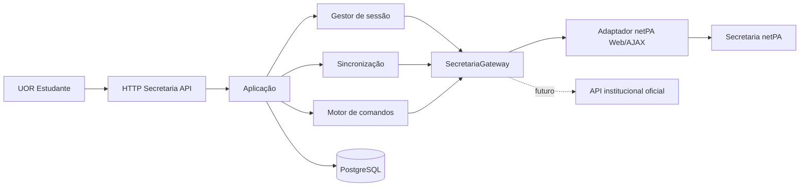

# API Secretaria → UOR Connect

## 1. Resumo executivo

A UOR Connect disponibilizará uma API estável para todas as capacidades da Secretaria Académica acessíveis ao estudante no netPA. A integração cobrirá consultas, sincronização e operações de escrita, incluindo perfil, fotografia, senha, inscrições, pedidos de revisão, consentimentos, dados académicos, situação financeira, geração e extração de referências e acompanhamento de pagamentos.

O frontend nunca conhecerá URLs, stages, cookies, campos de formulário, HTML ou identificadores internos do netPA. Esses detalhes pertencem a um adaptador isolado e substituível. A API pública trabalhará com contratos normalizados, IDs opacos, proveniência, cobertura, datas de observação e estados explícitos.

Operações de escrita serão comandos duráveis. Uma resposta HTTP 200 do portal não será considerada prova de sucesso. Cada comando terá idempotência, bloqueio por recurso, auditoria, evidência redigida e reconciliação por nova leitura da fonte oficial.

No âmbito financeiro, a UOR Connect poderá selecionar cobranças, solicitar ou extrair referências, iniciar o fluxo oficial, devolver instruções ou redirecionamentos permitidos e confirmar o estado no netPA. Não guardará dados de cartão, não manterá saldo, não custodiará fundos e não declarará um pagamento concluído sem confirmação oficial. Assim, a integração permanece compatível com a RN-EST-031.

## 2. Autoridade e alinhamento normativo

Esta especificação implementa a visão e os requisitos definidos em:

- `SDD-000-ECOSSISTEMA-UOR-CONNECT.md` para fronteiras, vocabulário e autoridade;
- `SDD-002-UOR-ESTUDANTE.md` para capacidades do produto;
- `SDD-005-CAPACIDADES-TRANSVERSAIS.md` para identidade, autorização, consentimento e auditoria;
- `UOR-ESTUDANTE-RF-RNF-REGRAS-NEGOCIO.md`, especialmente RF-EST-016 a RF-EST-025 e RF-EST-067 a RF-EST-072;
- ADR-002 para o monólito modular;
- ADR-003 para identidade institucional;
- ADR-004 para propriedade dos dados;
- ADR-005 para integrações externas.

O netPA é a fonte oficial dos factos académicos, administrativos e financeiros. A UOR Connect é proprietária das sessões cifradas, IDs públicos, comandos, auditoria, snapshots, preferências e projeções derivadas.

“Pagamento” nesta especificação significa orquestrar o fluxo oficial e observar o respetivo resultado. Processamento financeiro próprio, custódia de fundos ou captura direta de cartão exigem alteração formal da RN-EST-031 e não fazem parte deste contrato.

## 3. Evidência de viabilidade

Uma inspeção autenticada e não destrutiva confirmou login válido e respostas estruturadas para:

- perfil e boletim de matrícula;
- situação curricular, históricos, totais e regras de passagem;
- anos letivos, períodos, unidades curriculares, inscrições e notas;
- sumários, disciplinas e aulas;
- calendário e lista de exames;
- faltas e presenças;
- pagamentos e situação financeira;
- candidaturas existentes;
- formações avançadas;
- estágios;
- inscrições em épocas de exame;
- pedidos de revisão de nota;
- atividades extracurriculares;
- competências linguísticas;
- consentimentos;
- diretório público de cursos.

O portal usa páginas HTML, chamadas AJAX JSON e formulários de submissão. Existe viabilidade técnica alta para leitura e viabilidade condicionada para escrita: os contratos de formulário devem ser capturados em fixtures anonimizadas e verificados por operação antes da sua ativação.

O upstream observado usa HTTP sem TLS. Em produção, a integração só poderá ser habilitada através de endpoint HTTPS institucional ou de proxy/túnel privado aprovado que forneça TLS até à fronteira controlada. O acesso HTTP atual é permitido apenas no ambiente autorizado de desenvolvimento/homologação e exige configuração explícita.

## 4. Objetivos

- Expor todas as capacidades do portal relevantes ao estudante por contratos UOR estáveis.
- Suportar leitura ao vivo, snapshots e fallback controlado para dados já sincronizados.
- Suportar escritas académicas, administrativas, de perfil e financeiras disponíveis no portal.
- Impedir duplicação de efeitos em retentativas, timeouts e concorrência.
- Preservar prova verificável do resultado sem guardar segredos ou HTML pessoal bruto.
- Detetar alterações do contrato upstream e desativar apenas a capacidade afetada.
- Permitir substituir a automação web por API institucional oficial sem alterar consumidores.
- Documentar OpenAPI com exemplos seguros e estado real de implementação.

## 5. Não objetivos

- Substituir o netPA como sistema de registo.
- Expor cookies, credenciais, HTML, nomes de stages ou IDs internos.
- Guardar dados de cartão, PIN, CVV, códigos bancários ou outros instrumentos de pagamento.
- Declarar sucesso com base apenas no código HTTP ou numa mensagem textual isolada.
- Automatizar CAPTCHA, contornar MFA ou ultrapassar controlos de autorização do portal.
- Permitir acesso administrativo genérico aos dados dos estudantes.
- Inventar escrita para capacidades que o portal disponibiliza apenas para consulta.

## 5.1 Delta normativo obrigatório

O pedido aprovado amplia capacidades que os requisitos atuais descrevem apenas como consulta ou preparação. Antes da implementação funcional, o documento de RF/RNF/RN deve incorporar e submeter à mesma governação os seguintes requisitos reservados:

- RF-EST-085: atualizar dados pessoais explicitamente editáveis na Secretaria;
- RF-EST-086: atualizar/remover fotografia institucional quando suportado;
- RF-EST-087: alterar senha da Secretaria com step-up e renovação atómica da ligação;
- RF-EST-088: atualizar consentimentos disponibilizados pelo portal;
- RF-EST-089: criar e cancelar inscrição em época de exame quando permitido;
- RF-EST-090: submeter e acompanhar pedido oficial de revisão de nota;
- RF-EST-091: submeter/alterar candidaturas enquanto o portal permitir;
- RF-EST-092: gerir formações avançadas, estágios, atividades e competências linguísticas editáveis;
- RF-EST-093: gerar ou extrair referência oficial para cobranças selecionadas;
- RF-EST-094: iniciar o fluxo oficial de pagamento sem captura/custódia de fundos;
- RF-EST-095: reconciliar e confirmar pagamento exclusivamente pela fonte oficial;
- RF-EST-096: consultar e descarregar recibos/documentos financeiros permitidos;
- RNF-EST-041: persistir toda escrita como comando idempotente, auditável e reconciliável;
- RNF-EST-042: exigir step-up e confirmação em duas fases para comandos de risco alto;
- RNF-EST-043: isolar contract drift e circuit breaker por capacidade;
- RN-EST-056: resposta upstream não prova efeito sem pós-condição oficial;
- RN-EST-057: falha ambígua após submissão proíbe repetição automática da escrita;
- RN-EST-058: pagamento só é concluído após confirmação oficial e nunca por retorno do checkout;
- RN-EST-059: UOR Connect nunca recebe nem persiste instrumento de pagamento.

Esses IDs são uma proposta reservada por esta especificação e devem ser validados contra a sequência vigente durante a alteração do documento normativo. A implementação não marcará nenhuma dessas capacidades como `verified` antes da aprovação documental e da respetiva evidência de teste.

## 6. Abordagens consideradas

### 6.1 Proxy direto para o netPA

Cada rota UOR chamaria imediatamente uma página ou endpoint AJAX. É simples, mas acopla clientes ao portal, não sobrevive a falhas, duplica efeitos de escrita e dificulta auditoria. Foi rejeitado.

### 6.2 Microserviço autónomo

Isolaria credenciais e automação num processo próprio. Oferece uma fronteira forte, mas acrescenta deploy, observabilidade, filas e consistência distribuída antes de existir carga que o justifique. Fica como evolução.

### 6.3 Módulo isolado no monólito modular — escolhido

O módulo `backend/src/modules/secretaria` conterá domínio, aplicação, infraestrutura e HTTP, com portas explícitas e sem dependências dos módulos de eventos ou direção. A persistência e os leases usarão PostgreSQL. A fronteira permite extrair o módulo para serviço separado futuramente.

## 7. Arquitetura

### 7.1 Camadas

- `domain`: modelos normalizados, estados, erros, invariantes e interfaces do gateway/repositório;
- `application`: sessão, consultas, sincronização, comandos, reconciliação e políticas;
- `infra`: cookie jar, cifragem, cliente HTTP, parsers, adaptador netPA e Prisma;
- `http`: schemas Zod, autenticação, rate limit, apresentação e OpenAPI;
- `fixtures`: respostas anonimizadas usadas apenas em testes.

Rotas não importam parsers nem conhecem o Prisma. Parsers não conhecem Fastify. O gateway não devolve HTML bruto à aplicação.

### 7.2 Portas principais

`SecretariaGateway` expõe operações por capacidade:

- autenticar, validar e terminar sessão;
- descobrir capacidades e identidade autenticada;
- consultar perfil e domínios académicos/financeiros;
- preparar, submeter e verificar uma mutação;
- descarregar um documento permitido por locator cifrado.

`SecretariaRepository` persiste ligação, sessão, snapshots, referências públicas, comandos, tentativas, evidências, documentos e leases.

`SecretariaApplication` é o único contrato consumido pelas rotas.

## 8. Sessão e credenciais

### 8.1 Ligação

`POST /api/v1/integrations/secretaria/session` recebe número de estudante, senha e consentimento para manter a ligação. A autenticação UOR Connect já identifica o estudante; o número recebido deve coincidir com o titular após normalização e com a identidade devolvida pelo netPA.

Credenciais e cookie jar são guardados em envelopes AES-256-GCM separados, com AAD contendo versão, finalidade, instituição, `studentId` e geração da ligação. A chave vem de keyring de ambiente, suporta rotação e nunca reside na base de dados.

Nenhuma credencial fornecida durante análise ou teste será adicionada ao código, documentação, fixtures, exemplos, logs ou `.env.example`.

### 8.2 Estados

- `DISCONNECTED`;
- `CONNECTING`;
- `CONNECTED`;
- `REFRESHING`;
- `REAUTH_REQUIRED`;
- `DEGRADED`;
- `UNAVAILABLE`.

Cada resposta de sessão inclui `actionRequired`, `retryable`, `lastAuthenticatedAt`, `lastSuccessfulSyncAt` e `capabilityCoverage`.

### 8.3 Renovação e concorrência

- cache L1 descifrado por até cinco minutos;
- single-flight por estudante dentro da instância;
- lease CAS em PostgreSQL entre instâncias;
- uma única repetição depois de renovar sessão expirada;
- cooldown progressivo após credenciais rejeitadas;
- geração da ligação impede worker antigo de restaurar sessão após logout;
- troca de senha substitui o envelope de credenciais e invalida todos os cookies anteriores atomicamente.

`DELETE /session` é idempotente, tenta logout upstream em best effort e elimina os segredos locais mesmo se o portal estiver indisponível.

## 9. Catálogo público da API

Todas as rotas personalizadas exigem estudante UOR ativo, usam `Cache-Control: private, no-store` e devolvem `meta.traceId`, `meta.source`, `meta.observedAt`, `meta.coverage` e `meta.stale` quando aplicável.

### 9.1 Integração e sessão

| Método | Rota | Finalidade |
|---|---|---|
| GET | `/` | Estado, versão e cobertura da integração. |
| GET | `/health` | Saúde operacional sem dados pessoais. |
| GET | `/capabilities` | Capacidades detetadas e estado `available`, `degraded`, `changed` ou `unsupported`. |
| POST | `/session` | Ligar ou substituir credenciais. |
| GET | `/session` | Consultar estado seguro da sessão. |
| DELETE | `/session` | Desligar e purgar segredos/snapshots conforme política. |
| POST | `/sync` | Iniciar sincronização idempotente. |
| GET | `/sync-runs/:runId` | Consultar execução e cobertura. |

### 9.2 Perfil e conta

| Método | Rota | Finalidade |
|---|---|---|
| GET | `/me` | Perfil institucional oficial normalizado. |
| PATCH | `/me/contact-details` | Alterar apenas campos editáveis confirmados pelo portal. |
| PUT | `/me/photo` | Atualizar fotografia com validação de formato/tamanho. |
| DELETE | `/me/photo` | Remover fotografia quando suportado. |
| POST | `/me/password-change-requests` | Criar comando de troca de senha com confirmação reforçada. |
| GET | `/consents` | Consultar consentimentos. |
| PATCH | `/consents/:consentId` | Atualizar consentimento permitido. |

Campos oficiais somente leitura nunca serão apresentados como editáveis. A resposta identifica proveniência e mutabilidade por campo.

### 9.3 Académico

| Método | Rota | Finalidade |
|---|---|---|
| GET | `/academic/overview` | Resumo curricular e académico. |
| GET | `/academic/history` | Histórico curricular. |
| GET | `/academic/enrollments` | Inscrições e unidades curriculares. |
| GET | `/academic/grades` | Notas oficiais e respetivo estado. |
| GET | `/academic/credits` | Totais de créditos e cobertura. |
| GET | `/academic/progression-rules` | Regras de passagem e conclusão. |
| GET | `/academic/classes` | Aulas e sumários. |
| GET | `/academic/exams` | Calendário/lista de exames. |
| GET | `/academic/absences` | Faltas. |
| GET | `/academic/attendance` | Presenças. |

### 9.4 Operações académicas e administrativas

| Método | Rota | Finalidade |
|---|---|---|
| GET | `/exam-registrations` | Consultar inscrições em épocas. |
| POST | `/exam-registrations` | Inscrever numa época disponível. |
| DELETE | `/exam-registrations/:id` | Cancelar quando a fonte permitir. |
| GET | `/grade-review-requests` | Consultar pedidos de revisão. |
| POST | `/grade-review-requests` | Submeter pedido e anexos permitidos. |
| GET | `/grade-review-requests/:id` | Estado e resposta oficial. |
| GET | `/applications` | Consultar candidaturas. |
| POST | `/applications` | Submeter candidatura apenas quando a capacidade autenticada existir. |
| GET | `/advanced-training` | Consultar formações avançadas. |
| POST | `/advanced-training` | Registar/submeter quando suportado. |
| PATCH | `/advanced-training/:id` | Alterar enquanto editável. |
| DELETE | `/advanced-training/:id` | Remover enquanto permitido. |
| GET | `/internships` | Consultar inscrições/estágios. |
| POST | `/internships` | Inscrever ou candidatar-se quando suportado. |
| DELETE | `/internships/:id` | Cancelar quando suportado. |
| GET | `/extracurricular-activities` | Consultar atividades. |
| POST | `/extracurricular-activities` | Registar atividade quando suportado. |
| PATCH | `/extracurricular-activities/:id` | Alterar atividade editável. |
| DELETE | `/extracurricular-activities/:id` | Remover atividade editável. |
| GET | `/language-competencies` | Consultar competências linguísticas. |
| POST | `/language-competencies` | Registar competência quando suportado. |
| PATCH | `/language-competencies/:id` | Alterar competência editável. |
| DELETE | `/language-competencies/:id` | Remover competência editável. |

Uma rota existir no contrato não autoriza inventar capacidade upstream. Quando a conta/portal não oferece a ação, a API devolve problema `SECRETARIA_CAPABILITY_UNSUPPORTED` com o estado factual do catálogo.

### 9.5 Finanças, referências e pagamentos

| Método | Rota | Finalidade |
|---|---|---|
| GET | `/finance/overview` | Resumo oficial: saldo, dívida, cobranças e atualização. |
| GET | `/finance/charges` | Propinas/cobranças, vencimento, moeda e estado. |
| GET | `/finance/payment-references` | Referências existentes, validade e estado. |
| POST | `/finance/payment-references` | Gerar/extrair referência para cobranças selecionadas. |
| GET | `/finance/payments` | Histórico e confirmação oficial de pagamentos. |
| GET | `/finance/receipts` | Recibos/documentos disponíveis. |
| GET | `/finance/receipts/:id/content` | Proxy seguro de recibo permitido. |
| POST | `/finance/payment-intents` | Iniciar fluxo oficial de pagamento. |
| GET | `/finance/payment-intents/:id` | Consultar estado local e oficial reconciliado. |
| POST | `/finance/payment-intents/:id/confirm` | Pedir reconciliação após ação externa. |
| POST | `/finance/payment-intents/:id/cancel` | Cancelar apenas antes do efeito irreversível e quando permitido. |

`POST /finance/payment-references` recebe IDs públicos de cobranças e, se o portal permitir pagamento parcial, o valor decimal e a moeda oficiais. A resposta poderá conter:

- entidade e referência;
- montante e moeda;
- validade;
- cobranças incluídas;
- instruções normalizadas;
- estado `generated`, `active`, `expired`, `paid`, `cancelled` ou `unknown`.

`POST /finance/payment-intents` nunca recebe dados de cartão. Pode devolver `nextAction` de tipo `display_reference`, `redirect` ou `wait_for_confirmation`. URLs são opacas para o cliente até passarem pela allowlist e nunca incluem cookies ou credenciais.

### 9.6 Comandos e evidência

| Método | Rota | Finalidade |
|---|---|---|
| GET | `/commands/:commandId` | Estado durável de qualquer escrita. |
| POST | `/commands/:commandId/confirm` | Confirmar comando sensível preparado. |
| POST | `/commands/:commandId/cancel` | Cancelar antes da submissão quando permitido. |
| GET | `/commands/:commandId/events` | Linha temporal segura e auditável. |

## 10. Motor de comandos de escrita

### 10.1 Estados

- `PREPARED`: validado, ainda sem submissão;
- `AWAITING_CONFIRMATION`: exige confirmação/step-up;
- `QUEUED`: pronto para execução;
- `SUBMITTING`: lease adquirido e pedido em curso;
- `VERIFYING`: resposta recebida, efeito ainda não provado;
- `REQUIRES_ACTION`: precisa de ação externa, como redirecionamento;
- `SUCCEEDED`: efeito confirmado na fonte oficial;
- `FAILED`: falha definitiva sem efeito confirmado;
- `UNKNOWN`: timeout/ambiguidade exige reconciliação;
- `CANCELLED`;
- `EXPIRED`.

Somente `SUCCEEDED` significa conclusão. `FAILED` só é usado quando a ausência de efeito foi comprovada; uma falha após submissão fica `UNKNOWN` até reconciliação.

### 10.2 Fluxo

1. Validar titular, sessão, schema, capacidade e janela temporal.
2. Exigir `Idempotency-Key` e calcular hash canónico de ator, ação, recurso e payload.
3. Obter estado atual do recurso e validar `resourceVersion`/`If-Match` quando aplicável.
4. Criar comando durável antes de qualquer escrita upstream.
5. Para risco médio/alto, emitir resumo de confirmação com token curto ligado ao comando.
6. Adquirir lease por estudante e agregado funcional.
7. Renovar/validar sessão e carregar a página de origem para obter campos ocultos e token vigente.
8. Submeter exatamente uma vez por tentativa confirmada.
9. Classificar resposta sem confiar apenas em status HTTP.
10. Ler novamente a fonte oficial e verificar pós-condições específicas.
11. Persistir resultado, hashes de evidência redigida e evento de auditoria.
12. Reconciliar `UNKNOWN` por backoff, sem repetir a escrita enquanto o efeito puder ter ocorrido.

Uma chave de idempotência reutilizada com payload diferente retorna `409`. A mesma chave e o mesmo payload retornam o comando original.

### 10.3 Níveis de risco

- baixo: atualização reversível e sem efeito académico/financeiro;
- médio: inscrição, cancelamento, consentimento, referência ou submissão administrativa;
- alto: troca de senha, pagamento, pedido com custo ou operação irreversível.

Risco médio exige confirmação explícita. Risco alto exige autenticação recente, OTP ligado ao comando e confirmação em duas fases. O token contém apenas identificador opaco, expira e não é reutilizável.

### 10.4 Verificação por pós-condição

Cada tipo de comando define prova própria. Exemplos:

- perfil: leitura devolve novos valores e versão posterior;
- fotografia: hash/versão da fotografia oficial muda;
- senha: nova autenticação funciona e a antiga sessão foi invalidada;
- inscrição em exame: inscrição aparece com época e disciplina esperadas;
- revisão de nota: pedido aparece com identificador/estado oficial;
- referência: entidade, referência, valor e cobranças aparecem no portal;
- pagamento: histórico ou cobrança oficial muda para estado confirmado.

## 11. Modelo de persistência

### 11.1 `SecretariaConnection`

Uma por estudante: estado, identidade externa, envelopes de credenciais/sessão, geração, versão, leases, contadores de falha, datas de autenticação/sync/uso, erro seguro e cobertura.

### 11.2 `SecretariaEntityRef`

Mapeia `(studentId, kind, externalKey)` para UUID público estável. IDs externos nunca são usados como autorização nem expostos diretamente.

### 11.3 Snapshots

Snapshots imutáveis e versionados por domínio:

- perfil;
- currículo/histórico;
- inscrições/notas/créditos;
- aulas/exames/faltas/presenças;
- finanças/cobranças/referências/pagamentos;
- candidaturas, estágios e pedidos;
- consentimentos e dados complementares.

Uma ligação aponta para a versão ativa. Uma sincronização grava staging e publica o ponteiro atomicamente, impedindo mistura de versões. Cada item contém hash normalizado, `observedAt`, `sourceUpdatedAt` quando disponível, cobertura e `stale`.

### 11.4 `SecretariaCommand`

Guarda UUID, estudante, tipo, risco, estado, chave/hash de idempotência, agregado bloqueado, payload normalizado cifrado quando sensível, versão esperada, resumo de confirmação, geração da ligação, tentativa atual, resultado seguro, timestamps e retenção.

### 11.5 `SecretariaCommandAttempt` e `SecretariaCommandEvidence`

Cada tentativa guarda lease, início/fim, classe de resposta, hash do pedido normalizado, hash da resposta, código seguro, estado de reconciliação e timestamps. Evidência nunca guarda senha, cookie, OTP, HTML pessoal bruto ou dados de cartão.

### 11.6 `SecretariaPaymentIntent`

Guarda relação com comando, cobranças, montante decimal, moeda, estado, `nextAction` seguro, referência pública, validade e datas de confirmação. Valores usam `Decimal`, nunca ponto flutuante.

### 11.7 `SecretariaSyncRun`

Execução durável com status, lease, domínios solicitados, cobertura por domínio, contagens, versão de staging/publicação e erro seguro.

## 12. Sincronização e frescura

- `live`: leitura confirmada no pedido atual;
- `fresh`: snapshot dentro do TTL do domínio;
- `stale`: snapshot anterior devolvido com data/fonte preservadas;
- `not_synced`: nenhuma observação válida;
- `unsupported`: capacidade não existe;
- `changed`: contrato upstream incompatível.

TTL é configurável por domínio. Notas, referências e estado de pagamento usam TTL curto; histórico estável pode usar TTL maior. Escritas sempre executam preflight e verificação ao vivo, independentemente do cache.

O worker usa lease, heartbeat, reclaim de execução abandonada e concorrência configurável. Pedidos duplicados reutilizam a execução compatível ativa.

## 13. Adaptador netPA

### 13.1 Regras HTTP

- cookie jar isolado por sessão;
- redirects manuais e host allowlist;
- timeout global e por pedido;
- limite de bytes por HTML, JSON e ficheiro;
- validação de content type;
- user agent próprio da integração;
- nunca enviar cookie para domínio/path incompatível;
- nunca seguir URL fornecida pelo portal para host não permitido;
- um budget por operação impede loops de navegação;
- parsers puros recebem texto/JSON e devolvem modelos tipados.

### 13.2 Descoberta de escrita

Cada mutação terá um contrato versionado com:

- stage/página de preparação;
- campos ocultos obrigatórios;
- nomes e formatos de campos editáveis;
- token/anti-CSRF do portal;
- método e destino de submissão;
- marcadores de sucesso/falha;
- pós-condição de verificação;
- fixture anonimizada de sucesso, validação, permissão e alteração de contrato.

Uma mutação só fica `available` quando todos esses elementos possuem teste de contrato e teste autorizado de ponta a ponta. Alteração de campo, token ou marcador muda a capacidade para `changed` e abre circuito apenas para essa operação.

### 13.3 Catálogo inicial confirmado

Foram observados contratos estruturados para perfil/datasets, histórico curricular, totais, regras, anos/períodos, inscrições/notas, sumários, exames, faltas, presenças, pagamentos, candidaturas, formações, estágios, inscrições em épocas, revisões, atividades, línguas e cursos públicos.

O adaptador tratará `SIGESPrivateDatasets/listaAlunos` como endpoint proibido para esta API: a capacidade do estudante não justifica expor uma lista mais ampla de alunos.

## 14. Segurança e privacidade

- HTTPS obrigatório entre cliente e UOR Connect;
- HTTPS ou túnel privado obrigatório para upstream em produção;
- autenticação UOR Connect e validação do titular em todos os pedidos;
- autorização por ação/recurso, sem wildcard universal;
- proteção CSRF nas mutações quando a autenticação do cliente usar cookie;
- rate limit por estudante, IP, tipo de comando e risco;
- OTP e autenticação recente para risco alto;
- AES-256-GCM para credenciais, sessão, payload sensível e locators;
- redaction no logger para senha, cookie, OTP, tokens, referências completas e envelopes;
- valores financeiros e referências mascarados em auditoria/notificações;
- ficheiros verificados por tamanho, assinatura/MIME e política de malware antes de submissão;
- downloads forçados como attachment, sem HTML executável inline;
- proteção SSRF por URL construída internamente e allowlist;
- nenhum erro público inclui body upstream, seletor ou stack trace;
- eliminação/soft-delete do estudante invalida sessão, comandos pendentes e snapshots privados;
- retenção definida por classe de dado e compatível com auditoria institucional.

## 15. Erros públicos

Erros seguem `application/problem+json` com `type`, `title`, `status`, `code`, `detail` seguro, `traceId`, `retryable` e `actionRequired`.

Códigos principais:

- `SECRETARIA_SESSION_REQUIRED`;
- `SECRETARIA_AUTH_FAILED`;
- `SECRETARIA_REAUTH_REQUIRED`;
- `SECRETARIA_UNAVAILABLE`;
- `SECRETARIA_UPSTREAM_CHANGED`;
- `SECRETARIA_CAPABILITY_UNSUPPORTED`;
- `SECRETARIA_VALIDATION_FAILED`;
- `SECRETARIA_PERMISSION_DENIED`;
- `SECRETARIA_RESOURCE_NOT_FOUND`;
- `SECRETARIA_COMMAND_CONFLICT`;
- `SECRETARIA_CONFIRMATION_REQUIRED`;
- `SECRETARIA_COMMAND_UNKNOWN`;
- `SECRETARIA_PAYMENT_ACTION_REQUIRED`;
- `SECRETARIA_UNSAFE_REDIRECT`;
- `SECRETARIA_RESPONSE_TOO_LARGE`;
- `SECRETARIA_CONFIGURATION_INVALID`.

Falhas transitórias devolvem `503` e `Retry-After` quando seguro. Estado ambíguo de escrita devolve `202` com o comando em `UNKNOWN`/`VERIFYING`, nunca erro que induza repetição cega.

## 16. Auditoria e observabilidade

Eventos mínimos:

- ligação, renovação e desligamento;
- início/fim/falha de sincronização;
- comando preparado, confirmado, submetido, reconciliado, cancelado ou expirado;
- referência gerada/consultada/partilhada;
- pagamento iniciado e confirmado oficialmente;
- contrato upstream alterado;
- capacidade aberta/fechada por circuit breaker;
- tentativa negada por ownership, step-up ou rate limit.

Auditoria contém ator, produto, ação, recurso opaco, resultado, risco, trace/command ID e tempo. Não contém segredos nem dados financeiros completos.

Métricas agregadas incluem latência e disponibilidade por capacidade, taxa de reautenticação, cobertura, comandos por estado, tempo de reconciliação, contract drift e circuit breakers. Labels não incluem estudante, referência ou disciplina.

## 17. OpenAPI e versionamento

- rota canónica: `/api/v1/integrations/secretaria`;
- schemas Zod são fonte do contrato HTTP;
- exemplos usam dados fictícios e nunca fixtures reais;
- segredos de entrada são `writeOnly`;
- IDs upstream, cookies, HTML e URLs internas não aparecem;
- paginação usa cursor opaco assinado;
- mudança incompatível cria `/api/v2`; novas capacidades compatíveis entram em v1;
- rota só é marcada como implementada quando ligada a aplicação real e coberta por teste.

## 18. Configuração

Variáveis previstas:

- `SECRETARIA_INTEGRATION_ENABLED`;
- `SECRETARIA_BASE_URL`;
- `SECRETARIA_ALLOW_INSECURE_UPSTREAM` apenas fora de produção;
- `SECRETARIA_FETCH_TIMEOUT_MS`;
- `SECRETARIA_OPERATION_TIMEOUT_MS`;
- `SECRETARIA_MAX_RESPONSE_BYTES`;
- `SECRETARIA_ACTIVE_ENCRYPTION_KEY_ID`;
- `SECRETARIA_ENCRYPTION_KEYS`;
- `SECRETARIA_SESSION_IDLE_TTL_MINUTES`;
- `SECRETARIA_L1_TTL_SECONDS`;
- `SECRETARIA_SYNC_CONCURRENCY`;
- `SECRETARIA_COMMAND_WORKER_ENABLED`;
- `SECRETARIA_COMMAND_CONCURRENCY`;
- `SECRETARIA_ALLOWED_REDIRECT_HOSTS`;
- `SECRETARIA_RECEIPT_MAX_BYTES`;
- `SECRETARIA_ATTACHMENT_MAX_BYTES`.

Em produção, configuração inválida, base HTTP ou keyring ausente impedem a inicialização da integração com erro seguro.

## 19. Estratégia de testes

### 19.1 Unidade

- normalização de todos os modelos;
- parsers JSON/HTML/formulário com fixtures anonimizadas;
- estados e invariantes de comando/pagamento;
- idempotência e hash canónico;
- cifragem, tamper, AAD e rotação;
- cookie jar, redirects, limites e timeout;
- máscara de referência e redaction.

### 19.2 Integração interna

- repositório Prisma em SQLite de teste e PostgreSQL compatível;
- CAS, leases, heartbeat e reclaim;
- publicação atómica de snapshots;
- `app.inject` para auth, ownership, CSRF, rate limit e schemas;
- logout/troca de senha concorrente com workers;
- comando duplicado, timeout após submissão e reconciliação;
- isolamento entre estudantes e instituições.

### 19.3 Contrato upstream

- login válido/inválido e sessão expirada;
- cada consulta confirmada;
- cada formulário de escrita: preparação, validação, sucesso e permissão;
- HTTP 200 com página de erro;
- JSON incompleto, HTML inesperado e mudança de campo;
- redirect externo, resposta excessiva e lentidão.

### 19.4 Ponta a ponta autorizada

Uma conta controlada executará uma matriz por capacidade. Operações reversíveis são criadas, verificadas e revertidas. Operações irreversíveis usam dados institucionais de teste previamente preparados. Pagamentos não usam cartão real; geração de referência e estado são verificados, e qualquer hosted checkout termina antes da entrega de instrumento financeiro salvo procedimento institucional específico.

O teste registra apenas IDs opacos, timestamps, hashes e resultado. Credenciais e respostas pessoais não entram em artefactos.

## 20. Migração do código atual

1. Preservar o prefixo já reservado `/api/v1/integrations/secretaria`.
2. Substituir o status `planned` por composição `DisabledSecretariaApplication`/`LiveSecretariaApplication`.
3. Extrair a integração localizada em `auth/infra/secretaria-client.ts` para o novo gateway.
4. Fazer o login existente depender de uma porta de identidade institucional, sem importar infraestrutura da Secretaria.
5. Reutilizar o padrão já validado no módulo Moodle para keyring, sessão, repository e composition root, generalizando apenas primitivas realmente transversais.
6. Adicionar modelos Prisma e migrações sem alterar tabelas Moodle.
7. Implementar primeiro sessão/capabilities e leituras; depois ativar o motor comum de comandos.
8. Ativar operações de escrita individualmente após contrato e teste autorizado.
9. Atualizar matriz de rastreabilidade somente com `[x]` quando o estado for `verified`.

Alterações locais preexistentes nos módulos `secretaria`, `platform-context`, nas rotas e no frontend são preservadas e integradas conscientemente; não são sobrescritas por migração mecânica.

## 21. Sequência de entrega

### Fase A — fundação

Configuração, domínio, erros, gateway, repository, cifragem, sessão, capabilities, health e OpenAPI base.

### Fase B — leitura completa

Perfil, currículo, notas, aulas, exames, assiduidade, finanças, candidaturas, estágios, inscrições, revisões, atividades, línguas e consentimentos, com snapshots e sync.

### Fase C — motor de comandos

Persistência, estados, idempotência, confirmação, leases, tentativas, evidência, reconciliação e auditoria.

### Fase D — escritas de perfil e académicas

Contacto, fotografia, consentimentos, inscrições, revisões, candidaturas e registos complementares suportados.

### Fase E — referências e pagamentos

Seleção de cobranças, geração/extração de referência, payment intent, ação externa, estado, reconciliação, histórico e recibos.

### Fase F — segurança de conta e endurecimento

Troca de senha, step-up, testes de concorrência, contract drift, circuit breakers, retenção, observabilidade e validação completa.

Todas as fases fazem parte do escopo aprovado. A divisão controla risco e permite verificar cada capacidade antes da seguinte.

## 22. Critérios de aceitação

- Todas as páginas/capacidades autenticadas descobertas estão representadas no catálogo.
- Consultas devolvem modelos normalizados, proveniência, cobertura e frescura.
- Nenhuma resposta expõe segredo, cookie, HTML ou ID interno.
- Sessão e credenciais são cifradas, rotacionáveis e isoladas por estudante.
- IDs públicos são opacos e todo acesso revalida ownership.
- Toda escrita exige idempotência e possui estado durável.
- Comando só fica `SUCCEEDED` depois de pós-condição oficial confirmada.
- Timeout após submissão não provoca repetição automática destrutiva.
- Referência contém valor, moeda, validade, estado e cobranças oficiais.
- Pagamento só fica confirmado após prova no histórico/estado oficial.
- A UOR Connect não recebe nem persiste dados de cartão.
- Troca de senha invalida sessão antiga e atualiza credenciais cifradas atomicamente.
- Mudança upstream fecha apenas a capacidade afetada e emite alerta observável.
- Snapshots não misturam versões e fallback `stale` é explícito.
- OpenAPI corresponde às rotas e schemas executáveis.
- Testes unitários, integração, contrato e matriz E2E autorizada passam.
- Cada requisito marcado `[x]` possui evidência e teste verificável.

## 23. Questões abertas controladas

Não há decisão funcional pendente que impeça o plano de implementação. As condições externas abaixo são tratadas como critérios operacionais, não como lacunas do contrato:

| ID | Condição | Responsável | Impacto | Estado | Documento a atualizar |
|---|---|---|---|---|---|
| OQ-SEC-001 | Disponibilizar HTTPS ou túnel privado até ao netPA para produção. | Infraestrutura UOR | Bloqueia ativação produtiva, não desenvolvimento autorizado. | open | SDD-002 e runbook de deploy |
| OQ-SEC-002 | Confirmar quais operações financeiras terminam em referência versus hosted checkout por perfil. | Secretaria/Financeiro | Define `nextAction`, sem alterar proibição de custódia. | in_analysis | catálogo de capabilities |
| OQ-SEC-003 | Disponibilizar dados institucionais reversíveis para a matriz E2E de escrita. | Secretaria/QA | Condiciona estado `verified` de cada mutação. | in_analysis | matriz de rastreabilidade |

## 24. Decisão final

A API será implementada como módulo completo da UOR Estudante, com leitura e escrita, adaptador netPA substituível, sessão cifrada, snapshots versionados e motor durável de comandos. Referências e pagamentos fazem parte do contrato, respeitando a fronteira de que a UOR Connect orquestra e confirma o fluxo oficial, mas não processa nem custodia dinheiro.
