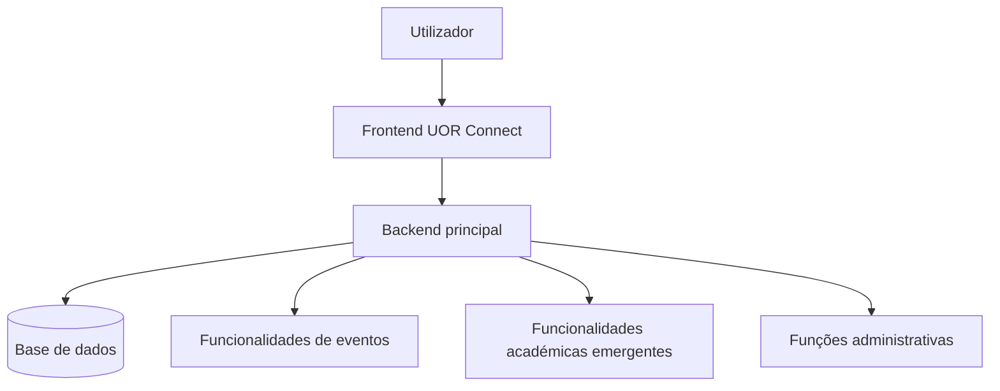
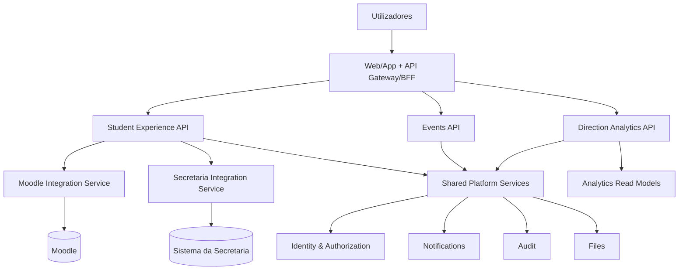
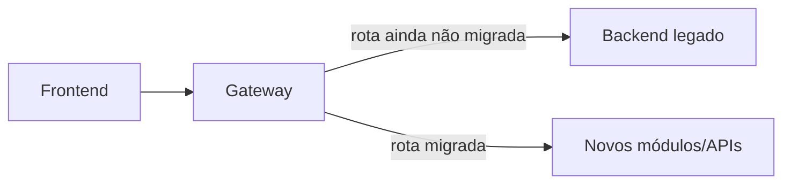

# SDD-001 — Migração da Plataforma UOR Connect

```yaml
document_id: SDD-001-V1
status: superseded
owner: CAVINOVA
authority: historical
version: 1.0
last_reviewed: 2026-07-21
superseded_by: ../../../vision/uor-connect-v2/MIG-001-TRANSICAO-PLATAFORMA-ATUAL.md
```

> Preservado como histórico. A transição vigente é `MIG-001` v2.

**Organização:** CAVINOVA
**Sistema:** UOR Connect
**Versão:** 1.0
**Data:** 2026-07-19
**Estado:** Proposto
**Classificação:** Interno

---

## 1. Finalidade

Este documento define o desenho técnico e a estratégia de migração da UOR Connect de uma aplicação centrada em eventos para uma plataforma institucional modular.

A arquitetura alvo separa três experiências:

- **UOR Connect Estudante:** vida académica individual;
- **UOR Connect Eventos:** participação e gestão de eventos;
- **UOR Connect Direção:** visão estratégica e institucional.

A migração deve preservar o funcionamento atual, evitar perda de dados, reduzir acoplamento e permitir evolução independente dos domínios.

---

## 2. Objetivos

### 2.1 Funcionais

- Separar menus, jornadas e permissões por produto.
- Criar APIs específicas por domínio.
- Integrar Moodle e Secretaria através de serviços próprios.
- Preservar Eventos como produto independente.
- Criar uma base segura para a Direção.
- Permitir identidade única sem misturar contextos.

### 2.2 Técnicos

- Reduzir dependências entre módulos.
- Aplicar fronteiras de domínio explícitas.
- Impedir acesso direto do frontend a sistemas institucionais.
- Criar contratos versionados.
- Permitir rollout gradual e rollback.
- Introduzir observabilidade e auditoria.
- Melhorar segurança e testabilidade.

### 2.3 Não objetivos

Esta migração não pretende:

- substituir o Moodle;
- substituir o sistema da Secretaria;
- alterar diretamente notas oficiais;
- criar um data warehouse completo na primeira fase;
- obrigar adoção imediata de microsserviços independentes;
- reescrever toda a plataforma de uma só vez.

---

## 3. Contexto e motivação

A UOR Connect nasceu orientada a eventos académicos. A expansão para aprendizagem, notas, finanças, serviços e indicadores institucionais cria necessidades que não pertencem ao mesmo domínio.

Manter tudo numa única experiência provoca:

- menus irrelevantes;
- permissões amplas;
- modelos de dados confusos;
- regressões cruzadas;
- ciclos de release acoplados;
- dificuldade de auditoria;
- risco de exposição de dados;
- impossibilidade de evoluir cada produto de forma independente.

A solução é uma plataforma modular com identidade partilhada e domínios isolados.

---

## 4. Glossário

| Termo | Definição |
|---|---|
| AS-IS | Estado atual do sistema |
| TO-BE | Arquitetura alvo |
| Bounded Context | Fronteira explícita de regras, dados e linguagem |
| ACL | Anti-Corruption Layer |
| RBAC | Controlo de acesso por função |
| ABAC | Controlo de acesso por atributos |
| PII | Dados pessoais identificáveis |
| Source of Truth | Sistema autoritativo de um dado |
| Strangler Fig | Migração progressiva substituindo partes do legado |
| Feature Flag | Controlo de ativação sem novo deployment |
| Outbox | Padrão para publicação confiável de eventos |
| RPO | Perda máxima aceitável de dados |
| RTO | Tempo máximo para restaurar serviço |

---

## 5. Princípios arquiteturais

1. Uma fonte autoritativa por tipo de dado.
2. Frontend nunca integra diretamente sistemas externos.
3. Contratos estáveis escondem detalhes internos.
4. Segurança por negação padrão.
5. Permissões por recurso e ação.
6. Migração incremental, não reescrita total.
7. Observabilidade antes da remoção do legado.
8. Dados pessoais apenas no contexto necessário.
9. Falhas externas não devem derrubar toda a plataforma.
10. Cada produto possui navegação e indicadores próprios.

---

## 6. Arquitetura AS-IS



### 6.1 Problemas

- um backend conhece demasiados domínios;
- rotas e componentes partilham estado indevidamente;
- ausência de contratos externos estáveis;
- risco de permissões baseadas apenas em perfil;
- dados de Eventos e Estudante podem coexistir sem fronteira;
- alterações de um módulo afetam outros;
- ausência de catálogo formal de ownership;
- dificuldade em distinguir dado oficial, pedagógico e calculado.

---

## 7. Arquitetura TO-BE



---

## 8. Bounded Contexts

### 8.1 Identity and Access

Responsável por utilizadores, identidades, sessões, roles, permissões, pertença institucional, MFA e consentimentos.

### 8.2 Student Experience

Responsável pela visão Hoje, agenda unificada, aprendizagem, vida académica, finanças, serviços e percurso. Não é proprietário de notas nem faturas. Apenas apresenta dados normalizados.

### 8.3 Moodle Integration

Responsável por sessão Moodle, disciplinas, materiais, atividades, calendário, mensagens, progresso, normalização e sincronização.

### 8.4 Secretaria Integration

Responsável por notas oficiais, matrícula, currículo, estado académico, propinas, pagamentos, dívidas, requerimentos e documentos.

### 8.5 Events

Responsável por eventos, inscrições, projetos, votação, agenda, QR Codes, passaporte, ranking, certificados e gamificação.

### 8.6 Direction Analytics

Responsável por indicadores, read models, relatórios, métricas agregadas, alertas institucionais e acesso auditado a detalhe autorizado.

---

## 9. Estratégia de migração

Será utilizado o padrão **Strangler Fig**.



### 9.1 Fase 0 — Descoberta e controlo

Entregáveis:

- inventário de rotas;
- inventário de tabelas;
- matriz de permissões;
- catálogo de dependências;
- mapa de integrações;
- baseline de performance;
- telemetria de utilização;
- backup validado.

Critério de saída: nenhuma migração começa sem saber quem consome cada rota.

### 9.2 Fase 1 — Separação lógica

- criar módulos internos por domínio;
- separar DTOs;
- separar repositórios;
- impedir imports cruzados não autorizados;
- introduzir nomes de rota por contexto;
- criar feature flags.

Um monólito modular é aceitável nesta fase.

### 9.3 Fase 2 — Gateway e contratos

- criar `/api/v1/student`;
- criar `/api/v1/events`;
- criar `/api/v1/direction`;
- criar `/api/v1/integrations/moodle`;
- criar `/api/v1/integrations/secretaria`;
- publicar OpenAPI;
- introduzir envelope `{ data, meta }`;
- usar IDs opacos e paginação por cursor.

### 9.4 Fase 3 — Migração de Eventos

- manter comportamento atual;
- mover rotas para domínio Events;
- migrar inscrições, projetos, votos e certificados;
- validar paridade funcional;
- ativar por evento ou organização.

### 9.5 Fase 4 — Integrações institucionais

- implementar Moodle Integration Service;
- implementar Secretaria Integration Service;
- sincronização assíncrona;
- cache;
- estados de cobertura;
- tratamento de reautenticação.

### 9.6 Fase 5 — Student Experience

- construir visão Hoje;
- agregar agenda;
- apresentar notas oficiais;
- apresentar finanças;
- integrar materiais e atividades;
- separar claramente origem dos dados.

### 9.7 Fase 6 — Direção

- criar read models agregados;
- definir política de privacidade;
- disponibilizar indicadores autorizados;
- auditar consultas;
- evitar acesso indiscriminado a PII.

### 9.8 Fase 7 — Desativação do legado

Uma rota só pode ser removida quando:

- não recebe tráfego durante janela definida;
- existe alternativa estável;
- testes de regressão estão aprovados;
- consumidores foram notificados;
- rollback foi ensaiado;
- logs e métricas confirmam segurança da remoção.

---

## 10. Compatibilidade

### 10.1 Versionamento

- APIs públicas sob `/api/v1`.
- Mudanças incompatíveis exigem nova versão.
- Campos novos são aditivos.
- Campos removidos passam por depreciação.

### 10.2 Adaptadores

Durante a transição, o backend legado pode chamar módulos novos através de adaptadores, mas os novos módulos não devem depender de regras internas do legado.

### 10.3 Contrato de erro

```json
{
  "error": {
    "code": "RESOURCE_NOT_FOUND",
    "message": "O recurso solicitado não foi encontrado.",
    "traceId": "01J..."
  }
}
```

Não expor stack trace, query SQL, URL interna, cookie ou token.

---

## 11. Estratégia de dados

### 11.1 Ownership

| Dado | Fonte autoritativa |
|---|---|
| Nota oficial | Secretaria |
| Estado de matrícula | Secretaria |
| Propina e pagamento | Secretaria |
| Material pedagógico | Moodle |
| Resultado de atividade | Moodle |
| Evento | Events |
| Voto | Events |
| Perfil UOR Connect | Identity/Profile |
| Indicador agregado | Direction Analytics |

### 11.2 Padrões permitidos

- cache;
- snapshot;
- read model;
- índice de pesquisa;
- histórico de sincronização;
- métricas agregadas.

### 11.3 Padrões proibidos

- cópia sem origem;
- nota “oficial” calculada;
- tabela partilhada por todos os domínios;
- joins diretos entre bases de serviços;
- edição de dados upstream sem contrato;
- armazenamento de palavra-passe sem necessidade formal.

---

## 12. Modelo de integração

### 12.1 Síncrono

Usado para leitura rápida em cache, autenticação, detalhes solicitados e comandos curtos.

### 12.2 Assíncrono

Usado para sincronização, geração de certificados, relatórios, notificações, recomposição de indicadores e processamento de ficheiros.

### 12.3 Eventos internos

- `student.sync.completed`
- `student.sync.failed`
- `event.registration.created`
- `event.project.submitted`
- `event.vote.recorded`
- `finance.charge.updated`
- `grade.official.updated`

Eventos devem usar schema versionado.

---

## 13. Rotas de frontend

```text
/estudante
/estudante/hoje
/estudante/academico
/estudante/aprendizagem
/estudante/agenda
/estudante/financas
/estudante/servicos
/estudante/percurso

/eventos
/eventos/:eventId
/eventos/:eventId/agenda
/eventos/:eventId/projetos
/eventos/:eventId/votacao
/eventos/:eventId/passaporte

/direcao
/direcao/academico
/direcao/financeiro
/direcao/eventos
/direcao/relatorios
/direcao/auditoria
```

Cada contexto deve ter layout, navegação, permissões e carregamento próprios.

---

## 14. Requisitos não funcionais

### 14.1 Disponibilidade

- serviços críticos: objetivo inicial de 99,5%;
- integrações externas podem operar em modo degradado;
- cache deve permitir leitura recente quando upstream estiver indisponível.

### 14.2 Performance

- p95 de leitura em cache: até 500 ms;
- p95 de leitura agregada: até 1,5 s;
- sincronizações longas: assíncronas;
- paginação obrigatória em coleções.

### 14.3 Escalabilidade

- frontend e APIs stateless;
- sessões externas cifradas em armazenamento controlado;
- filas para tarefas;
- locks distribuídos por estudante e integração.

### 14.4 Segurança

- TLS;
- controlo de acesso por recurso;
- rate limiting;
- proteção CSRF;
- rotação de segredos;
- logs redigidos;
- auditoria;
- backups cifrados.

---

## 15. Feature flags

Flags mínimas:

- `student_experience_enabled`
- `moodle_integration_enabled`
- `secretaria_integration_enabled`
- `events_v2_enabled`
- `direction_enabled`
- `legacy_routes_enabled`

Escopos possíveis: global, instituição, curso, utilizador e evento.

Feature flags não substituem autorização.

---

## 16. Rollout

Ordem sugerida:

1. equipa interna;
2. ambiente de staging;
3. grupo piloto;
4. curso piloto;
5. percentagem progressiva;
6. adoção geral.

Métricas de controlo:

- taxa de erro;
- latência;
- falhas de login;
- divergência de dados;
- reclamações;
- falhas de sincronização;
- utilização de fallback.

---

## 17. Rollback

Cada fase deve ter:

- flag de desativação;
- versão anterior disponível;
- migrations reversíveis ou expand/contract;
- backup testado;
- plano de reconciliação;
- runbook.

O rollback não pode depender de apagar dados produzidos pela nova versão.

---

## 18. Migração de base de dados

Usar **expand and contract**:

1. adicionar novas estruturas;
2. escrever em ambas quando necessário;
3. migrar dados;
4. validar;
5. mudar leitura;
6. parar escrita antiga;
7. remover estrutura após janela de segurança.

Nunca combinar alteração destrutiva e release funcional no mesmo passo.

---

## 19. Testes

### 19.1 Obrigatórios

- unitários;
- integração;
- contrato;
- E2E;
- regressão;
- segurança;
- carga;
- recuperação;
- migração;
- isolamento multi-tenant;
- autorização negativa.

### 19.2 Casos críticos

- estudante A não lê dados do estudante B;
- utilizador de Eventos não acede à Direção;
- notas Moodle não aparecem como oficiais;
- sessão externa nunca chega ao frontend;
- falha do Moodle não derruba Eventos;
- rollback preserva dados;
- rotas antigas e novas mantêm semântica equivalente durante transição.

---

## 20. Observabilidade

Cada pedido deve possuir:

- `traceId`;
- `requestId`;
- `actorId` pseudonimizado;
- produto;
- domínio;
- duração;
- resultado;
- origem dos dados;
- estado de cache.

Métricas mínimas:

- taxa de erro;
- p50/p95/p99;
- filas;
- duração de sincronização;
- taxa de falhas de sync;
- cache hit rate;
- autenticações falhadas;
- negações de autorização;
- utilização de endpoints legados.

---

## 21. Riscos

| Risco | Impacto | Mitigação |
|---|---:|---|
| Contratos upstream instáveis | Alto | ACL, cache e testes de integração |
| Mistura de notas Moodle e oficiais | Alto | labels, ownership e testes |
| Migração big bang | Alto | Strangler Fig |
| Falta de telemetria | Alto | instrumentar antes de remover |
| Permissões demasiado amplas | Alto | RBAC + ABAC + ownership |
| Sessões externas inválidas | Médio | reauth e estados explícitos |
| Dados divergentes | Alto | reconciliação e origem visível |
| Duplicação permanente | Médio | política de retenção e ownership |
| Falta de rollback | Alto | flags e expand/contract |

---

## 22. Critérios de aceitação

A migração global será aceite quando:

- produtos possuírem rotas e layouts separados;
- contratos OpenAPI estiverem publicados;
- Moodle e Secretaria forem consumidos apenas por integrações;
- notas oficiais vierem exclusivamente da Secretaria;
- Eventos operar sem dependência da Student Experience;
- Direção consumir read models autorizados;
- ownership e isolamento forem testados;
- observabilidade cobrir rotas antigas e novas;
- rollback estiver validado;
- endpoints legados tiverem plano formal de desativação.

---

## 23. ADRs

### ADR-001 — Plataforma modular antes de microsserviços

**Decisão:** começar por monólito modular quando adequado e extrair processos apenas quando houver necessidade operacional.

**Motivo:** reduzir o risco de criar complexidade distribuída prematuramente.

### ADR-002 — Strangler Fig

**Decisão:** substituir o legado por rotas e módulos progressivos.

### ADR-003 — APIs normalizadas

**Decisão:** o frontend não conhece URLs, cookies, HTML ou IDs internos de Moodle e Secretaria.

### ADR-004 — Fonte autoritativa explícita

**Decisão:** cada dado possui uma origem oficial documentada.

### ADR-005 — Direção baseada em read models

**Decisão:** dashboards não consultam indiscriminadamente bases transacionais.

---

## 24. Pendências

- inventário real do repositório;
- tecnologia atual do backend;
- estratégia institucional de SSO;
- acesso técnico ao sistema da Secretaria;
- política legal de retenção;
- requisitos de disponibilidade;
- volume real de utilizadores;
- infraestrutura de produção;
- responsáveis por aprovação institucional.

---

## 25. Conclusão

A UOR Connect deve evoluir como plataforma, não como um menu crescente dentro da aplicação original.

A separação entre Estudante, Eventos e Direção permite segurança, clareza de produto e evolução independente, mantendo serviços partilhados apenas onde existe real benefício técnico.
