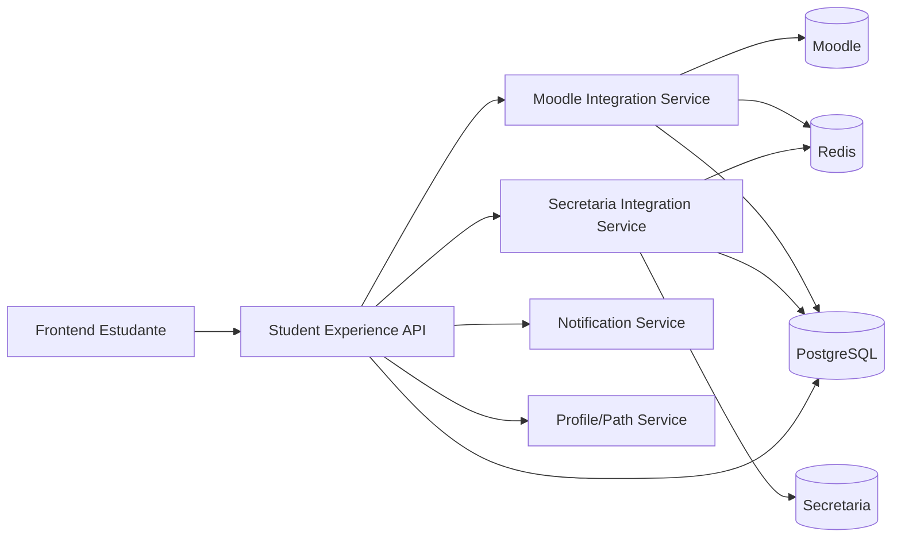
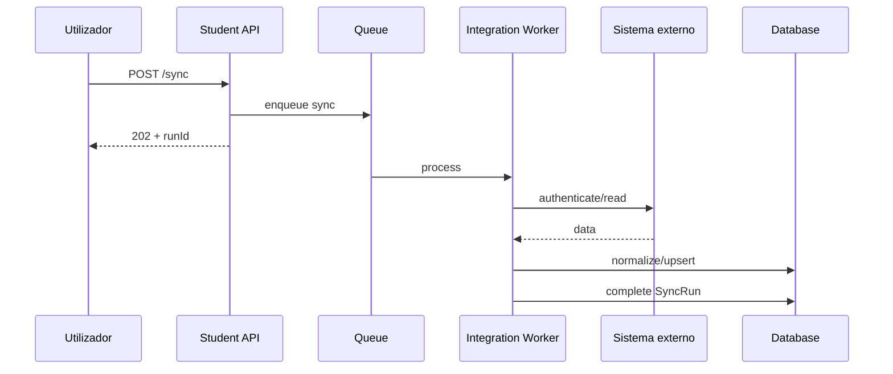

# SDD-002 — UOR Connect Estudante e Integrações Institucionais

```yaml
document_id: SDD-002-V1
status: superseded
owner: CAVINOVA
authority: historical
version: 1.0
last_reviewed: 2026-07-21
superseded_by: ../../../vision/uor-connect-v2/SDD-002-UOR-ESTUDANTE.md
```

> Preservado como histórico. O nome normativo atual é UOR Estudante.

**Versão:** 1.0
**Data:** 2026-07-19
**Estado:** Proposto
**Âmbito:** Student Experience, Moodle Integration Service e Secretaria Integration Service

---

## 1. Finalidade

Definir a arquitetura da UOR Connect Estudante e das integrações responsáveis por apresentar dados pedagógicos, académicos, administrativos e financeiros numa experiência única.

---

## 2. Princípio central

```text
Moodle
→ informação pedagógica

Secretaria
→ informação oficial académica, administrativa e financeira

UOR Connect Estudante
→ organização, contexto, alertas, análise e orientação
```

A UOR Connect não substitui as fontes institucionais e não atribui autoridade oficial a dados que não a possuem.

---

## 3. Objetivos do produto

- reduzir fragmentação;
- organizar tarefas e prazos;
- facilitar acesso a materiais;
- mostrar notas oficiais;
- mostrar finanças;
- acompanhar requerimentos;
- unificar agenda;
- apresentar progresso;
- criar alertas;
- construir histórico académico e extracurricular.

---

## 4. Navegação

```text
Hoje
Vida Académica
Aprendizagem
Agenda
Finanças
Serviços
Biblioteca
Comunicação
Meu Percurso
```

### 4.1 Hoje

Deve responder:

- o que aconteceu;
- o que vence primeiro;
- qual a próxima aula;
- qual atividade está pendente;
- qual pagamento vence;
- qual aviso exige ação.

### 4.2 Vida Académica

- matrícula;
- curso;
- ano;
- plano curricular;
- disciplinas;
- notas oficiais;
- histórico;
- situação de conclusão.

### 4.3 Aprendizagem

- disciplinas Moodle;
- materiais;
- trabalhos;
- questionários;
- progresso;
- mensagens;
- avisos.

### 4.4 Finanças

- saldo;
- propinas;
- pagamentos;
- dívidas;
- multas;
- bolsas;
- recibos;
- próximos vencimentos.

---

## 5. Arquitetura



---

## 6. Student Experience API

### 6.1 Responsabilidade

- compor dados;
- aplicar autorização;
- ordenar prioridades;
- criar visão Hoje;
- unificar agenda;
- devolver estados de sincronização;
- esconder detalhes das integrações.

### 6.2 Não responsabilidades

- autenticar diretamente no Moodle;
- calcular nota oficial;
- criar fatura;
- alterar matrícula;
- expor HTML externo;
- armazenar cookies no browser.

### 6.3 Endpoints sugeridos

```http
GET /api/v1/student/me
GET /api/v1/student/today
GET /api/v1/student/overview
GET /api/v1/student/agenda
GET /api/v1/student/academic
GET /api/v1/student/learning
GET /api/v1/student/finance
GET /api/v1/student/services
GET /api/v1/student/path
GET /api/v1/student/sync-status
POST /api/v1/student/sync
```

`POST /sync` deve devolver `202 Accepted`.

---

## 7. Moodle Integration Service

### 7.1 Dados

- perfil;
- disciplinas;
- secções;
- materiais;
- atividades;
- trabalhos;
- quizzes;
- mensagens;
- anúncios;
- eventos;
- progresso, quando disponível.

### 7.2 Endpoints

```http
POST   /api/v1/integrations/moodle/session
DELETE /api/v1/integrations/moodle/session
GET    /api/v1/integrations/moodle/session/status
POST   /api/v1/integrations/moodle/session/reauth

GET    /api/v1/integrations/moodle/me
GET    /api/v1/integrations/moodle/overview
GET    /api/v1/integrations/moodle/courses
GET    /api/v1/integrations/moodle/courses/{courseId}
GET    /api/v1/integrations/moodle/courses/{courseId}/sections
GET    /api/v1/integrations/moodle/courses/{courseId}/materials
GET    /api/v1/integrations/moodle/materials
GET    /api/v1/integrations/moodle/materials/{materialId}/open
GET    /api/v1/integrations/moodle/activities
GET    /api/v1/integrations/moodle/calendar
GET    /api/v1/integrations/moodle/messages

POST   /api/v1/integrations/moodle/sync
GET    /api/v1/integrations/moodle/sync/status
GET    /api/v1/integrations/moodle/sync/runs
GET    /api/v1/integrations/moodle/sync/runs/{runId}
```

### 7.3 Regras

- nunca devolver cookie;
- nunca devolver sesskey;
- nunca devolver credencial;
- nunca devolver URL privada;
- nunca devolver HTML bruto;
- IDs públicos opacos;
- ficheiros abertos por proxy controlado ou redirect assinado;
- validar domínio de origem;
- bloquear SSRF;
- progresso indisponível deve ser `null`.

---

## 8. Secretaria Integration Service

### 8.1 Dados académicos oficiais

- processo;
- curso;
- matrícula;
- plano curricular;
- disciplinas;
- notas;
- médias;
- resultado;
- histórico;
- cadeiras em atraso;
- conclusão.

### 8.2 Dados financeiros

- propinas;
- pagamentos;
- dívidas;
- multas;
- descontos;
- bolsas;
- acordos;
- referências;
- recibos;
- saldo;
- vencimentos.

### 8.3 Serviços

- requerimentos;
- declarações;
- certificados;
- documentos emitidos;
- estados;
- rejeições;
- ações exigidas.

### 8.4 Endpoints

```http
POST   /api/v1/integrations/secretaria/session
DELETE /api/v1/integrations/secretaria/session
GET    /api/v1/integrations/secretaria/session/status
POST   /api/v1/integrations/secretaria/session/reauth

GET    /api/v1/integrations/secretaria/me
GET    /api/v1/integrations/secretaria/overview
GET    /api/v1/integrations/secretaria/academic-status
GET    /api/v1/integrations/secretaria/enrolments
GET    /api/v1/integrations/secretaria/curriculum
GET    /api/v1/integrations/secretaria/grades
GET    /api/v1/integrations/secretaria/grades/{gradeId}
GET    /api/v1/integrations/secretaria/transcript

GET    /api/v1/integrations/secretaria/finance/overview
GET    /api/v1/integrations/secretaria/finance/charges
GET    /api/v1/integrations/secretaria/finance/payments
GET    /api/v1/integrations/secretaria/finance/debts
GET    /api/v1/integrations/secretaria/finance/receipts

GET    /api/v1/integrations/secretaria/requests
GET    /api/v1/integrations/secretaria/requests/{requestId}

POST   /api/v1/integrations/secretaria/sync
GET    /api/v1/integrations/secretaria/sync/status
GET    /api/v1/integrations/secretaria/sync/runs
```

---

## 9. Modelo de resposta

```json
{
  "data": {
    "studentId": "stu_01J...",
    "status": "active"
  },
  "meta": {
    "source": "secretaria",
    "syncedAt": "2026-07-19T15:00:00Z",
    "stale": false,
    "coverage": "exact",
    "traceId": "01J..."
  }
}
```

---

## 10. Estados de cobertura

- `exact`
- `partial`
- `not_synced`
- `unsupported`
- `stale`
- `failed`

Não usar zero para representar dado desconhecido.

```json
{
  "progressAvailable": false,
  "progressPercent": null
}
```

---

## 11. Identificadores

Separar:

- `uorconnect_id`;
- `source_system`;
- `source_id`;
- `source_parent_id`;
- `resource_type`.

IDs de origem ficam apenas no backend.

---

## 12. Modelo de dados resumido

### 12.1 StudentIntegrationAccount

```text
id
student_id
provider
status
last_authenticated_at
last_sync_at
failure_count
paused_until
created_at
updated_at
```

### 12.2 ExternalCredential

```text
id
integration_account_id
ciphertext
nonce
key_version
created_at
rotated_at
```

### 12.3 ExternalSession

```text
id
integration_account_id
encrypted_cookie_jar
expires_at
last_used_at
created_at
```

### 12.4 SyncRun

```text
id
student_id
provider
status
started_at
completed_at
items_processed
items_failed
coverage
error_code
```

### 12.5 OfficialGrade

```text
id
student_id
course_unit_id
academic_year
assessment_type
value
scale
status
published_at
source_updated_at
synced_at
```

### 12.6 FinancialCharge

```text
id
student_id
reference
description
currency
original_amount
paid_amount
balance
status
issued_at
due_at
paid_at
source_updated_at
```

---

## 13. Sessão e autenticação externa

Ordem de preferência:

1. Web Services oficiais;
2. SSO/OAuth institucional;
3. token delegado;
4. sessão delegada;
5. credencial cifrada como fallback.

Se for necessário armazenar credencial:

- AES-256-GCM;
- nonce único;
- AAD;
- chave externa;
- versionamento de chave;
- rotação;
- acesso mínimo;
- nunca em logs;
- eliminação verificável.

---

## 14. Locks e concorrência

Sincronizações do mesmo estudante e provedor não devem correr em paralelo.

Usar Redis lock, PostgreSQL advisory lock ou mecanismo distribuído equivalente.

A chave deve incluir:

```text
institution_id + student_id + provider
```

---

## 15. Falhas

Categorias:

- `AUTH_INVALID_CREDENTIALS`
- `AUTH_SESSION_EXPIRED`
- `REAUTH_REQUIRED`
- `REAUTH_INTERACTIVE_REQUIRED`
- `UPSTREAM_UNAVAILABLE`
- `UPSTREAM_TIMEOUT`
- `UPSTREAM_CHANGED`
- `PARSING_FAILED`
- `RATE_LIMITED`
- `PARTIAL_SYNC`
- `INTERNAL_ERROR`

Não contabilizar falha de rede como palavra-passe errada.

Após três falhas reais de credencial:

- suspender tentativa automática;
- devolver `REAUTH_REQUIRED`;
- exigir ação do estudante.

---

## 16. Sincronização



### 16.1 Estratégia

- sync incremental quando possível;
- full sync agendado;
- retries com backoff;
- dead-letter queue;
- idempotência;
- reconciliação periódica.

---

## 17. Cache

### 17.1 L1

Memória do processo para dados de vida muito curta.

### 17.2 L2

Redis para sessão lógica, resposta agregada, locks, rate limit e dados temporários.

### 17.3 Regras

- chave inclui instituição e estudante;
- nunca partilhar cache entre utilizadores;
- TTL por tipo de dado;
- invalidação após sync;
- dados sensíveis cifrados ou excluídos.

---

## 18. Visão Hoje

Prioridades podem usar prazo, impacto, estado, urgência, origem e ação requerida.

Exemplos:

- trabalho vence amanhã;
- propina vence em três dias;
- nota oficial publicada;
- material novo;
- requerimento exige documento;
- aula alterada.

O algoritmo deve explicar por que o item aparece.

---

## 19. Agenda unificada

Fontes:

- Moodle;
- Secretaria;
- Eventos;
- UOR Connect.

Campos:

```text
id
title
type
source
starts_at
ends_at
deadline_at
location
action_url
priority
status
```

Conflitos de horário devem ser sinalizados, não corrigidos silenciosamente.

---

## 20. Notas

### 20.1 Etiquetas obrigatórias

- `Oficial — Secretaria`
- `Pedagógica — Moodle`
- `Estimativa — UOR Connect`

### 20.2 Regras

- estimativa nunca substitui oficial;
- média calculada deve mostrar fórmula;
- dados incompletos indicam cobertura;
- notas não publicadas não são inferidas.

---

## 21. Finanças

Exibir:

- saldo atual;
- total vencido;
- próximo vencimento;
- pagamentos recentes;
- recibos;
- estado de bolsa;
- bloqueios conhecidos.

Cada valor deve indicar moeda, estado, emissão, vencimento, pagamento, origem e sincronização.

---

## 22. Segurança

- ownership em todas as queries;
- testes BOLA/IDOR;
- CSRF;
- cookies SameSite, Secure e HttpOnly;
- rate limit;
- reautenticação para ações sensíveis;
- log redaction;
- auditoria;
- retenção mínima;
- segregação institucional;
- testes que garantam que cookies não chegam ao frontend.

---

## 23. DELETE e privacidade

Separar operações:

```http
DELETE /session
DELETE /integration
DELETE /synced-data
```

- `/session`: termina sessão externa.
- `/integration`: remove credencial e vínculo.
- `/synced-data`: remove cópias locais permitidas.

Cada operação deve declarar impacto e exigir confirmação adequada.

---

## 24. Testes

- parsing de respostas externas;
- mudança de HTML;
- sessão expirada;
- MFA/interação humana;
- dados parciais;
- upstream lento;
- duplicação;
- idempotência;
- ownership;
- isolamento de cache;
- SSRF;
- cookies no frontend;
- notas oficiais versus pedagógicas;
- valores monetários e arredondamento.

---

## 25. Critérios de aceitação

- estudante vê apenas os próprios dados;
- notas oficiais vêm apenas da Secretaria;
- Moodle não é apresentado como fonte oficial;
- finanças indicam moeda e datas;
- sync é assíncrono;
- sessão externa não vaza;
- erros são classificados;
- dados têm origem e sincronização;
- progresso desconhecido é `null`;
- integração pode ser removida;
- Swagger corresponde à implementação.

---

## 26. Roadmap

### Fase A

- sessão;
- perfil;
- cursos;
- materiais;
- notas;
- finanças;
- estado de sync.

### Fase B

- Hoje;
- agenda;
- requerimentos;
- mensagens;
- notificações.

### Fase C

- percurso;
- alertas de risco;
- recomendações;
- analytics estudantil responsável.

---

## 27. Decisões

- integrações não expõem detalhes upstream;
- Secretaria é autoridade oficial;
- Moodle é autoridade pedagógica;
- Student API compõe, não domina os dados;
- sincronização longa é assíncrona;
- credencial persistida é último recurso.

---

## 28. Pendências

- forma real de autenticação da Secretaria;
- existência de API oficial;
- formato de notas;
- política de retenção financeira;
- sistema de recibos;
- acesso a documentos;
- suporte a MFA;
- termos institucionais de integração.
