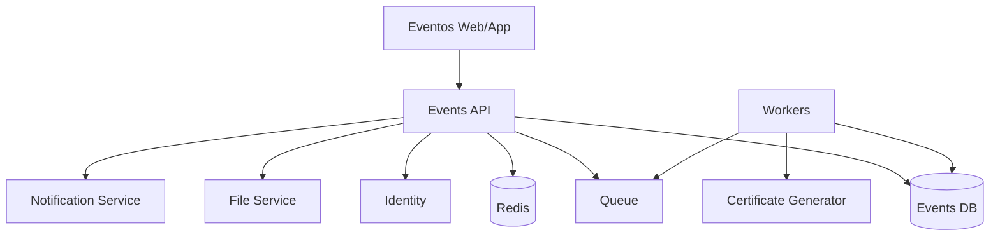
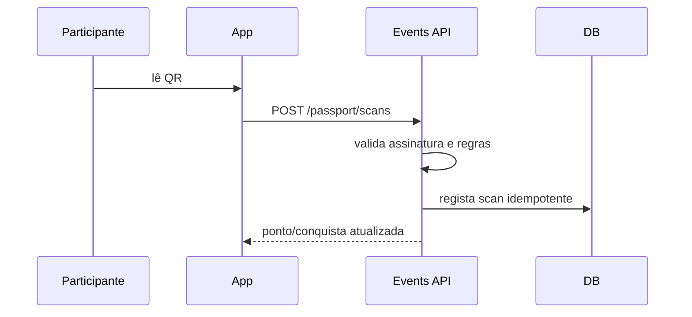

# SDD-003 — UOR Connect Eventos

```yaml
document_id: SDD-003-V1
status: superseded
owner: CAVINOVA
authority: historical
version: 1.0
last_reviewed: 2026-07-21
superseded_by: ../../../vision/uor-connect-v2/SDD-003-UOR-EVENTOS.md
```

> Preservado como histórico. O nome normativo atual é UOR Eventos.

**Versão:** 1.0
**Data:** 2026-07-19
**Estado:** Proposto

---

## 1. Finalidade

Definir a arquitetura do produto UOR Connect Eventos como domínio independente da experiência Estudante e da Direção.

---

## 2. Objetivos

- gerir eventos académicos;
- permitir inscrição;
- apresentar agenda;
- gerir palestrantes;
- expor projetos;
- permitir votação;
- oferecer QR Codes e passaporte;
- aplicar gamificação;
- emitir certificados;
- produzir métricas operacionais.

---

## 3. Não objetivos

Eventos não deve:

- apresentar notas oficiais;
- gerir propinas;
- alterar matrículas;
- funcionar como portal académico;
- conceder acesso à Direção;
- depender da disponibilidade do Moodle ou Secretaria.

---

## 4. Perfis

- participante;
- visitante;
- estudante;
- expositor;
- palestrante;
- avaliador;
- staff;
- gestor do evento;
- administrador.

---

## 5. Arquitetura



---

## 6. Módulos

### 6.1 Catálogo de eventos

- eventos públicos e privados;
- estado;
- datas;
- local;
- capacidade;
- regras;
- identidade visual.

### 6.2 Inscrição

- formulário;
- consentimento;
- validação;
- confirmação;
- lista de espera;
- check-in;
- cancelamento.

### 6.3 Agenda

- sessões;
- salas;
- trilhas;
- palestrantes;
- conflitos;
- favoritos;
- lembretes.

### 6.4 Projetos

- submissão;
- equipa;
- categoria;
- descrição;
- ficheiros;
- estado;
- exposição;
- avaliação.

### 6.5 Votação

- elegibilidade;
- janela;
- categorias;
- limites;
- antifraude;
- anonimato configurável;
- apuramento;
- auditoria.

### 6.6 Passaporte digital

- pontos de visita;
- QR Codes;
- missões;
- validação;
- conquistas;
- prevenção de repetição.

### 6.7 Gamificação

- pontos;
- badges;
- níveis;
- desafios;
- ranking;
- regras versionadas.

### 6.8 Certificados

- elegibilidade;
- template;
- emissão;
- assinatura e verificação;
- revogação;
- download.

---

## 7. Rotas de frontend

```text
/eventos
/eventos/:eventId
/eventos/:eventId/agenda
/eventos/:eventId/palestrantes
/eventos/:eventId/projetos
/eventos/:eventId/votacao
/eventos/:eventId/passaporte
/eventos/:eventId/ranking
/eventos/:eventId/certificados
/eventos/:eventId/gestao
```

---

## 8. API

```http
GET    /api/v1/events
POST   /api/v1/events
GET    /api/v1/events/{eventId}
PATCH  /api/v1/events/{eventId}

POST   /api/v1/events/{eventId}/registrations
GET    /api/v1/events/{eventId}/registrations/me
DELETE /api/v1/events/{eventId}/registrations/me

GET    /api/v1/events/{eventId}/sessions
POST   /api/v1/events/{eventId}/sessions
GET    /api/v1/events/{eventId}/speakers

GET    /api/v1/events/{eventId}/projects
POST   /api/v1/events/{eventId}/projects
GET    /api/v1/events/{eventId}/projects/{projectId}
PATCH  /api/v1/events/{eventId}/projects/{projectId}

POST   /api/v1/events/{eventId}/votes
GET    /api/v1/events/{eventId}/votes/me

POST   /api/v1/events/{eventId}/check-ins
POST   /api/v1/events/{eventId}/passport/scans
GET    /api/v1/events/{eventId}/passport/me

GET    /api/v1/events/{eventId}/leaderboard
GET    /api/v1/events/{eventId}/certificates/me
POST   /api/v1/events/{eventId}/certificates/generate
```

---

## 9. Estados do evento

- `draft`
- `published`
- `registration_open`
- `registration_closed`
- `live`
- `completed`
- `archived`
- `cancelled`

Transições devem ser validadas e auditadas.

---

## 10. Modelo de dados

### Event

```text
id
institution_id
slug
name
description
status
starts_at
ends_at
timezone
location
capacity
registration_opens_at
registration_closes_at
created_by
```

### Registration

```text
id
event_id
user_id
status
registered_at
checked_in_at
consent_version
```

### Project

```text
id
event_id
owner_user_id
category_id
title
summary
description
status
submitted_at
published_at
```

### Vote

```text
id
event_id
voter_user_id
project_id
category_id
created_at
idempotency_key
```

### PassportScan

```text
id
event_id
user_id
checkpoint_id
scanned_at
device_fingerprint_hash
validation_status
```

### Certificate

```text
id
event_id
user_id
template_version
verification_code
issued_at
revoked_at
```

---

## 11. Votação

### 11.1 Regras

- um utilizador não pode exceder o limite;
- voto deve ser idempotente;
- janela deve estar aberta;
- projeto deve ser elegível;
- ator deve possuir permissão;
- antifraude não deve bloquear injustamente sem revisão.

### 11.2 Privacidade

Resultados parciais podem ser ocultados até ao encerramento.

### 11.3 Auditoria

Registar ator, evento, categoria, timestamp e resultado da validação, sem expor o voto em relatórios públicos quando a votação for secreta.

---

## 12. QR Codes

O QR não deve conter dados pessoais nem permissões permanentes.

Conteúdo recomendado:

- token aleatório;
- escopo;
- evento;
- expiração;
- assinatura.

Validação:

- assinatura;
- expiração;
- evento;
- checkpoint;
- replay;
- frequência;
- estado do utilizador.

---

## 13. Passaporte digital



---

## 14. Gamificação

Regras devem ser:

- configuráveis por evento;
- versionadas;
- auditáveis;
- determinísticas;
- resistentes a repetição;
- recalculáveis.

Exemplo:

```text
check-in: 10 pontos
visita a expositor: 5 pontos
participação em sessão: 10 pontos
missão concluída: 20 pontos
```

---

## 15. Certificados

Critérios possíveis:

- inscrição válida;
- check-in;
- presença mínima;
- sessão concluída;
- projeto aprovado;
- participação como palestrante.

O certificado deve possuir código verificável, hash, template versionado, data, emissor e estado de revogação.

---

## 16. Notificações

- confirmação de inscrição;
- alteração de agenda;
- início de sessão;
- prazo de submissão;
- resultado de avaliação;
- certificado disponível;
- evento cancelado.

Preferências e consentimento devem ser respeitados.

---

## 17. Administração

Funções:

- criar evento;
- publicar;
- gerir equipa;
- definir regras;
- importar participantes;
- moderar projetos;
- gerir agenda;
- fechar votação;
- emitir certificados;
- exportar relatórios.

Ações sensíveis exigem auditoria.

---

## 18. Segurança

- ownership;
- RBAC e ABAC;
- rate limiting;
- antifraude;
- idempotência;
- proteção contra enumeração;
- uploads validados;
- antivírus;
- URLs assinadas;
- logs redigidos;
- segregação por evento e instituição.

---

## 19. Performance

- leaderboard pré-calculado;
- cache de agenda;
- CDN para ficheiros públicos;
- filas para certificados;
- paginação;
- WebSocket ou SSE apenas quando necessário.

---

## 20. Operação offline parcial

Para check-in em conectividade limitada:

- lista assinada e cifrada;
- validade curta;
- dispositivo autorizado;
- registo local;
- sincronização posterior;
- reconciliação;
- deteção de duplicação.

---

## 21. Analytics

Métricas operacionais:

- inscrições;
- presença;
- sessões;
- projetos;
- votos válidos;
- scans;
- certificados;
- retenção no evento.

Dados enviados à Direção devem ser agregados e governados.

---

## 22. Migração do produto atual

1. inventariar funcionalidades;
2. congelar contrato antigo;
3. criar Events module;
4. migrar leitura;
5. migrar escrita;
6. validar votos e certificados;
7. ativar por evento;
8. remover rotas antigas.

---

## 23. Testes

- inscrição duplicada;
- limite de capacidade;
- lista de espera;
- voto repetido;
- voto fora da janela;
- QR expirado;
- replay;
- certificado sem elegibilidade;
- isolamento entre eventos;
- moderador de evento A no evento B;
- carga em votação;
- concorrência no leaderboard.

---

## 24. Critérios de aceitação

- Eventos funciona sem Moodle ou Secretaria;
- menus académicos não aparecem;
- permissões são específicas;
- votação é auditável;
- QR não contém PII;
- certificados são verificáveis;
- operações longas são assíncronas;
- migração pode ser revertida;
- métricas são produzidas sem acesso indevido.

---

## 25. Decisões

- Events é domínio próprio;
- gamificação usa regras versionadas;
- votação usa idempotência;
- certificados são artefactos verificáveis;
- QR usa token assinado de curta duração;
- Direção consome apenas métricas governadas.
