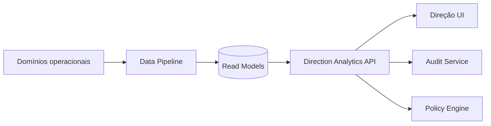
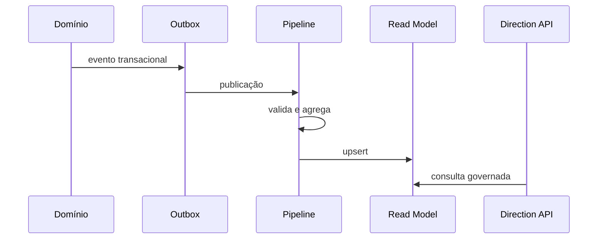

# SDD-004 — UOR Connect Direção

```yaml
document_id: SDD-004-V1
status: superseded
owner: CAVINOVA
authority: historical
version: 1.0
last_reviewed: 2026-07-21
superseded_by: ../../../vision/uor-connect-v2/SDD-004-UOR-DIRECAO.md
```

> Preservado como histórico. O nome normativo atual é UOR Direção.

**Versão:** 1.0
**Data:** 2026-07-19
**Estado:** Proposto

---

## 1. Finalidade

Definir a experiência estratégica da Direção sem transformar a plataforma num mecanismo de acesso indiscriminado a dados pessoais.

---

## 2. Objetivos

- apresentar indicadores institucionais;
- apoiar decisão;
- acompanhar desempenho;
- identificar riscos;
- gerar relatórios;
- consolidar dados de Estudante, Eventos e operação;
- garantir privacidade e auditoria.

---

## 3. Público

- reitoria;
- direção académica;
- direção financeira;
- direção administrativa;
- coordenações;
- responsáveis autorizados.

---

## 4. Princípios

1. agregação por padrão;
2. detalhe apenas quando necessário;
3. finalidade legítima;
4. mínimo privilégio;
5. auditoria integral;
6. indicadores explicáveis;
7. nenhuma decisão automática de alto impacto sem revisão humana.

---

## 5. Arquitetura



A Direção não consulta diretamente as bases transacionais.

---

## 6. Áreas

```text
Visão Geral
Académico
Financeiro
Aprendizagem
Eventos
Serviços
Relatórios
Alertas
Auditoria
```

---

## 7. Indicadores académicos

- matrículas;
- retenção;
- aprovação;
- reprovação;
- abandono;
- conclusão;
- disciplinas críticas;
- distribuição de notas;
- progressão;
- procura por curso.

As definições devem estar num catálogo de métricas.

---

## 8. Indicadores financeiros

- faturação;
- pagamentos;
- saldo vencido;
- acordos;
- bolsas;
- evolução temporal;
- distribuição agregada;
- previsões claramente identificadas.

Dados financeiros individuais exigem autorização específica.

---

## 9. Indicadores de aprendizagem

- acesso ao Moodle;
- participação;
- materiais consultados;
- atividades entregues;
- progressão agregada;
- disciplinas com baixa participação.

Uso pedagógico não pode ser confundido com avaliação oficial.

---

## 10. Indicadores de eventos

- inscrições;
- presença;
- sessões;
- projetos;
- votação;
- participação;
- certificados;
- satisfação.

---

## 11. Catálogo de métricas

Cada métrica deve declarar:

- nome;
- definição;
- fórmula;
- fonte;
- frequência;
- dimensão;
- proprietário;
- limitações;
- nível de sensibilidade;
- data da última atualização.

Exemplo:

```text
Nome: Taxa de aprovação
Fórmula: estudantes aprovados / estudantes avaliados
Fonte: Secretaria
Frequência: diária
Sensibilidade: agregada
```

---

## 12. API

```http
GET /api/v1/direction/overview
GET /api/v1/direction/academic
GET /api/v1/direction/academic/courses
GET /api/v1/direction/academic/course-units
GET /api/v1/direction/finance
GET /api/v1/direction/learning
GET /api/v1/direction/events
GET /api/v1/direction/services
GET /api/v1/direction/alerts
GET /api/v1/direction/reports
POST /api/v1/direction/reports
GET /api/v1/direction/reports/{reportId}
GET /api/v1/direction/audit
```

---

## 13. Read models

Exemplos:

- `academic_daily_summary`;
- `course_performance_summary`;
- `finance_monthly_summary`;
- `moodle_engagement_summary`;
- `event_participation_summary`;
- `service_request_summary`.

Read models devem possuir período, instituição, dimensão, valor, fonte, versão da métrica e data de atualização.

---

## 14. Privacidade

### 14.1 Agregação mínima

Não apresentar grupos demasiado pequenos. O limiar deve ser configurado conforme política institucional.

### 14.2 Pseudonimização

Identificadores usados em análise devem ser pseudonimizados.

### 14.3 Drill-down

Detalhe individual só quando:

- a função permite;
- a finalidade está declarada;
- o pedido é auditado;
- o campo é necessário;
- a política autoriza.

---

## 15. Autorização

Exemplos:

```text
direction.overview.read
direction.academic.metrics.read
direction.finance.metrics.read
direction.student.detail.read
direction.report.generate
direction.audit.read
```

A permissão de métricas não concede detalhe individual.

---

## 16. Auditoria

Registar:

- ator;
- papel;
- instituição;
- métrica;
- filtros;
- acesso a detalhe;
- motivo;
- data;
- exportação;
- resultado.

Exportações sensíveis devem ser marcadas.

---

## 17. Relatórios

- assíncronos;
- formato controlado;
- expiração;
- download assinado;
- watermark;
- auditoria;
- controlo de campos;
- prevenção de CSV injection.

---

## 18. Alertas institucionais

Exemplos:

- queda anormal de aprovação;
- aumento de dívida vencida;
- disciplina com baixa participação;
- pico de abandono;
- evento com baixa adesão.

Alertas devem explicar regra, período, fonte, confiança e limitações.

---

## 19. Qualidade de dados

Estados:

- completo;
- parcial;
- atrasado;
- indisponível;
- em reconciliação.

O dashboard deve mostrar qualidade e data de atualização, não apenas números isolados.

---

## 20. Pipeline



---

## 21. Segurança

- SSO;
- MFA para perfis privilegiados;
- sessão curta;
- reautenticação para exportações;
- segregação;
- logs;
- DLP;
- rate limit;
- criptografia;
- revisão periódica de acessos.

---

## 22. Testes

- coordenador vê apenas curso autorizado;
- financeiro não vê detalhe académico indevido;
- grupo pequeno é ocultado;
- exportação é auditada;
- read model atrasado mostra estado;
- métrica corresponde à definição;
- drill-down exige permissão;
- dados de outra instituição não aparecem.

---

## 23. Critérios de aceitação

- nenhuma consulta direta às bases operacionais;
- catálogo de métricas aprovado;
- indicadores mostram origem e atualização;
- acesso individual é excecional e auditado;
- exportações possuem controlo;
- qualidade de dados é visível;
- permissões são granulares;
- MFA em perfis privilegiados.

---

## 24. Roadmap

### Fase 1

- visão geral;
- indicadores agregados;
- catálogo;
- auditoria.

### Fase 2

- relatórios;
- alertas;
- drill-down controlado.

### Fase 3

- previsões responsáveis;
- simulações;
- benchmarking interno.

---

## 25. Decisões

- read models separados;
- agregação por padrão;
- métrica versionada;
- acesso individual auditado;
- modelos preditivos não decidem automaticamente.
