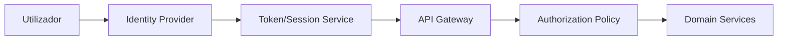
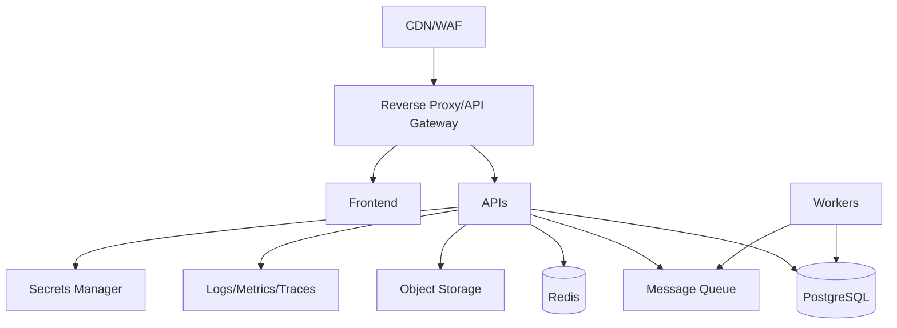

# SDD-005 — Identidade, Segurança e Infraestrutura da UOR Connect

```yaml
document_id: SDD-005-V1
status: superseded
owner: CAVINOVA
authority: historical
version: 1.0
last_reviewed: 2026-07-21
superseded_by: ../../../vision/uor-connect-v2/SDD-005-CAPACIDADES-TRANSVERSAIS.md
```

> Preservado como histórico. A autoridade transversal vigente é o SDD-005 v2.

**Versão:** 1.0
**Data:** 2026-07-19
**Estado:** Proposto

---

## 1. Finalidade

Definir os controlos transversais que suportam UOR Connect Estudante, Eventos e Direção, incluindo identidade, autenticação, autorização, segurança de aplicações, proteção de dados, observabilidade, infraestrutura e continuidade operacional.

---

## 2. Arquitetura de identidade



---

## 3. Identidade única, contextos separados

Um utilizador pode possuir múltiplos vínculos:

- estudante;
- participante;
- palestrante;
- colaborador;
- coordenador;
- direção;
- administrador.

A interface só mostra contextos autorizados. A existência de uma conta não concede acesso a todos os produtos.

---

## 4. Autenticação

Preferência arquitetural:

1. SSO institucional;
2. OpenID Connect;
3. OAuth 2.1;
4. MFA para acessos privilegiados.

Deve ser evitada a duplicação de credenciais por produto.

### 4.1 Requisitos

- política de palavras-passe adequada quando houver autenticação local;
- proteção contra credential stuffing;
- lockout progressivo, não destrutivo;
- deteção de anomalia;
- recuperação de conta segura;
- verificação de contacto;
- MFA obrigatório para administradores e Direção.

---

## 5. Sessões

- access token de curta duração;
- refresh token seguro;
- rotação de refresh token;
- revogação;
- deteção de reutilização;
- cookies `HttpOnly`, `Secure` e `SameSite`;
- inventário de sessões e dispositivos;
- logout do dispositivo;
- logout global;
- expiração por inatividade;
- reautenticação para ações sensíveis.

Tokens não devem conter dados académicos ou financeiros desnecessários.

---

## 6. Autorização

Combinar:

- RBAC;
- ABAC;
- ownership;
- escopo de instituição;
- estado do recurso;
- finalidade da ação.

Exemplo:

```text
permit if
role == student
and action == grades.read
and resource.student_id == actor.student_id
and resource.institution_id == actor.institution_id
```

A autorização deve ser aplicada no backend em cada pedido. Esconder um botão no frontend é ergonomia, não segurança, apesar da estranha persistência humana em tratar CSS como controlo de acesso.

---

## 7. Perfis base

- `student`
- `event_participant`
- `exhibitor`
- `speaker`
- `event_staff`
- `academic_staff`
- `finance_staff`
- `coordinator`
- `direction`
- `system_admin`

Perfis são conjuntos de permissões, não atalhos para acesso ilimitado.

---

## 8. Permissões

Padrão:

```text
<domain>.<resource>.<action>
```

Exemplos:

```text
student.grades.read_own
student.finance.read_own
events.project.submit
events.vote.create
direction.academic_metrics.read
direction.finance_metrics.read
admin.identity.manage
```

### 8.1 Regras

- negação por padrão;
- princípio do menor privilégio;
- revisão periódica;
- expiração de acessos temporários;
- separação de funções;
- elevação temporária auditada;
- nenhuma permissão implícita por nome de cargo.

---

## 9. Multi-tenancy

Todas as entidades relevantes devem possuir `institution_id`.

Regras:

- filtros obrigatórios;
- índices compostos;
- testes negativos;
- cache por tenant;
- filas com contexto;
- storage paths segregados;
- chaves de idempotência com tenant;
- auditoria com tenant.

A ausência de `institution_id` numa entidade institucional deve ser tratada como falha de desenho.

---

## 10. Criptografia

### 10.1 Em trânsito

- TLS 1.2 ou superior;
- HSTS;
- certificados geridos;
- comunicação interna cifrada conforme risco;
- validação estrita de certificados upstream.

### 10.2 Em repouso

- disco cifrado;
- backups cifrados;
- campos sensíveis cifrados;
- envelope encryption;
- chaves fora da base de dados.

### 10.3 Credenciais externas

Quando não existir alternativa institucional:

- AES-256-GCM;
- nonce único;
- AAD;
- versão da chave;
- rotação;
- acesso mínimo;
- eliminação verificável;
- métricas sem conteúdo sensível.

---

## 11. Gestão de segredos

Segredos não devem existir em:

- repositório;
- imagem Docker;
- logs;
- ficheiros de exemplo;
- frontend;
- documentação;
- parâmetros de linha de comando persistidos;
- histórico do shell.

Usar secret manager ou mecanismo equivalente. Acesso deve ser concedido por workload identity sempre que possível.

---

## 12. Segurança de API

- validação de input por schema;
- limite de tamanho;
- timeouts;
- CORS restrito;
- proteção CSRF;
- rate limiting;
- idempotency key;
- proteção contra mass assignment;
- output encoding;
- paginação;
- IDs opacos;
- headers de segurança;
- rejeição de content types inesperados;
- limites por utilizador, IP e instituição.

### 12.1 Contrato de erro

Erros externos devem ser normalizados. Não devolver stack traces, consultas SQL, nomes internos, cookies, tokens ou detalhes de infraestrutura.

---

## 13. Cobertura OWASP

A implementação e os testes devem cobrir:

- Broken Access Control;
- Cryptographic Failures;
- Injection;
- Insecure Design;
- Security Misconfiguration;
- Vulnerable and Outdated Components;
- Identification and Authentication Failures;
- Software and Data Integrity Failures;
- Security Logging and Monitoring Failures;
- SSRF.

---

## 14. Ficheiros

- validar MIME real;
- validar extensão;
- limitar tamanho;
- normalizar nome;
- analisar malware;
- armazenar fora do web root;
- usar storage privado;
- gerar URL assinada de curta duração;
- autorizar cada download;
- prevenir path traversal;
- impedir HTML ativo quando não necessário;
- usar Content-Disposition apropriado.

---

## 15. Logs

Nunca registar:

- password;
- cookie;
- token;
- Authorization header;
- sesskey;
- documento completo;
- notas completas sem necessidade;
- dados financeiros completos;
- credenciais upstream;
- corpo integral de pedidos sensíveis.

Usar redaction automática e testes que falhem quando um padrão proibido surgir nos logs.

---

## 16. Auditoria

Eventos mínimos:

- login;
- logout;
- falha de autenticação;
- alteração de role;
- leitura privilegiada;
- exportação;
- edição de evento;
- emissão e revogação de certificado;
- sincronização;
- remoção de integração;
- acesso a dados individuais pela Direção.

Campos:

```text
event_id
occurred_at
actor_id
institution_id
action
resource_type
resource_id
result
reason
trace_id
ip_hash
user_agent_hash
```

Auditoria deve ser imutável ou protegida contra alteração não autorizada.

---

## 17. Infraestrutura de referência



Componentes sugeridos:

- reverse proxy ou API gateway;
- frontend estático com CDN;
- APIs stateless;
- PostgreSQL;
- Redis;
- queue;
- object storage;
- workers;
- observability stack;
- secrets manager.

---

## 18. Ambientes

- local;
- development;
- staging;
- production.

Regras:

- credenciais distintas;
- bases distintas;
- secrets distintos;
- nenhum dado real em desenvolvimento sem anonimização;
- staging próximo da produção;
- acessos auditados;
- migrations testadas antes de produção.

---

## 19. PostgreSQL

- migrations versionadas;
- constraints;
- foreign keys dentro da fronteira do serviço;
- índices;
- transações;
- Row Level Security quando aplicável;
- pool de ligações;
- backups;
- point-in-time recovery;
- replicação conforme necessidade;
- monitorização de queries lentas.

Mudanças destrutivas usam expand/contract.

---

## 20. Redis

Usos permitidos:

- cache;
- locks distribuídos;
- rate limit;
- sessões lógicas;
- deduplicação;
- filas apenas se operacionalmente adequado.

Redis não é fonte permanente de verdade. Dados críticos devem sobreviver à sua perda.

---

## 21. Filas e workers

Requisitos:

- retry;
- exponential backoff;
- dead-letter queue;
- idempotência;
- visibility timeout;
- métricas;
- payload sem segredos;
- correlação com trace;
- limite de concorrência;
- possibilidade de reprocessamento controlado.

Tarefas:

- sincronização Moodle e Secretaria;
- notificações;
- geração de certificados;
- relatórios;
- atualização de read models;
- análise de ficheiros.

---

## 22. Containers

- imagem mínima;
- utilizador não-root;
- filesystem read-only quando possível;
- healthcheck;
- SBOM;
- scan de vulnerabilidades;
- versão fixa;
- sem segredos embutidos;
- limites de CPU e memória;
- graceful shutdown;
- sinalização correta.

---

## 23. CI/CD

Pipeline recomendado:

1. lint;
2. typecheck;
3. unit tests;
4. integration tests;
5. contract tests;
6. SAST;
7. dependency scan;
8. secret scan;
9. build;
10. SBOM;
11. container scan;
12. deploy em staging;
13. migrations compatíveis;
14. smoke tests;
15. aprovação;
16. produção;
17. monitorização pós-release.

### 23.1 Proteções

- branch protection;
- revisão obrigatória;
- status checks;
- assinatura quando disponível;
- credenciais de CI de curta duração;
- produção com aprovação explícita;
- rollback automatizado quando seguro.

---

## 24. Estratégia de deployment

A plataforma pode começar como monólito modular com workers separados.

Estratégias:

- rolling deployment;
- blue/green para alterações de alto risco;
- canary para funcionalidades novas;
- feature flags;
- expand/contract para base de dados.

Kubernetes só deve ser adotado quando volume, equipa e maturidade operacional justificarem o custo. Um cluster não corrige fronteiras de domínio mal feitas; apenas as distribui por mais sítios.

---

## 25. Observabilidade

### 25.1 Logs

- estruturados em JSON;
- correlação por trace;
- níveis consistentes;
- retenção definida;
- redaction.

### 25.2 Métricas

- request rate;
- error rate;
- latency;
- saturation;
- queue depth;
- DB connections;
- cache hit rate;
- auth failures;
- denied requests;
- sync failures;
- upstream health.

### 25.3 Traces

Propagar `traceId` entre gateway, APIs, workers e integrações.

---

## 26. Health checks

- `/health/live` — processo vivo;
- `/health/ready` — pronto para receber tráfego;
- `/health/dependencies` — estado resumido das dependências.

Health checks não devem expor segredos, versões internas detalhadas ou configuração.

---

## 27. Backups

- automáticos;
- cifrados;
- retenção definida;
- cópia geograficamente separada quando possível;
- testes periódicos de restauração;
- inventário;
- alertas de falha;
- controlo de acesso;
- registo de restaurações.

Backup não testado não é estratégia de recuperação.

---

## 28. Recuperação de desastre

Definir por serviço:

- RTO;
- RPO;
- dependências;
- contactos;
- runbook;
- prioridade;
- estratégia de comunicação.

Valores iniciais propostos:

| Componente | RTO | RPO |
|---|---:|---:|
| Identity | 2h | 15 min |
| Events durante evento | 1h | 5 min |
| Student API | 4h | 1h |
| Direction | 8h | 24h |

Os valores exigem aprovação institucional e testes.

---

## 29. Segurança da cadeia de fornecimento

- atualização automatizada de dependências;
- lockfiles;
- SBOM;
- scan de pacotes;
- proveniência de builds;
- revisão de código;
- branch protection;
- CI isolado;
- permissões mínimas;
- dependências de origem confiável;
- remoção de pacotes abandonados.

---

## 30. Gestão de vulnerabilidades

Cada vulnerabilidade deve possuir:

- severidade;
- ativo afetado;
- proprietário;
- SLA;
- plano de correção;
- validação;
- exceção documentada quando inevitável.

SLA inicial sugerido:

- crítica: 24 a 72 horas;
- alta: 7 dias;
- média: 30 dias;
- baixa: planeamento.

---

## 31. Testes de segurança

- SAST;
- DAST;
- dependency scan;
- secret scan;
- pentest;
- BOLA e IDOR;
- SSRF;
- upload malicioso;
- autenticação e sessão;
- isolamento de tenant;
- privilege escalation;
- replay;
- rate limit;
- fuga de logs;
- headers de segurança.

---

## 32. Retenção e eliminação

Cada tipo de dado deve possuir:

- finalidade;
- fonte;
- retenção;
- base institucional;
- método de eliminação;
- responsável;
- exceções.

Eliminar uma integração não significa apagar dados oficiais da origem. Deve significar remover credenciais, sessões e cópias locais conforme a política aplicável.

---

## 33. Resposta a incidentes

Processo:

1. detetar;
2. classificar;
3. conter;
4. preservar evidência;
5. erradicar;
6. recuperar;
7. comunicar;
8. rever.

Runbooks mínimos:

- fuga de token;
- conta privilegiada comprometida;
- indisponibilidade;
- corrupção de base;
- ransomware;
- exposição de storage;
- falha de integração;
- publicação indevida de dados.

---

## 34. Requisitos de produção

Antes de produção:

- TLS ativo;
- backups testados;
- logs redigidos;
- alertas configurados;
- rate limit;
- secrets manager;
- MFA administrativo;
- rollback;
- dashboards;
- ownership de serviços;
- runbooks;
- contactos de emergência;
- migrations ensaiadas;
- testes de autorização aprovados.

---

## 35. Critérios de aceitação

- identidade única;
- contextos separados;
- autorização por recurso;
- multi-tenant testado;
- segredos fora do código;
- sessões seguras;
- logs sem credenciais;
- auditoria ativa;
- backups restaurados em teste;
- CI com scans;
- resposta a incidentes documentada;
- métricas e alertas ativos;
- acessos privilegiados com MFA.

---

## 36. ADRs

### ADR-S01 — RBAC + ABAC + ownership

RBAC isolado é insuficiente para proteger dados individuais e contextos institucionais.

### ADR-S02 — Chaves externas

Chaves de cifragem não residem junto dos dados cifrados.

### ADR-S03 — APIs stateless

APIs stateless simplificam escalabilidade, recuperação e rollout.

### ADR-S04 — Kubernetes não obrigatório

Adoção apenas quando o custo operacional for justificado.

### ADR-S05 — Segurança como requisito de aceite

Nenhum produto entra em produção sem controlos mínimos demonstráveis.

---

## 37. Pendências

- fornecedor de identidade;
- infraestrutura atual;
- cloud ou servidor dedicado;
- volumes reais;
- política institucional;
- equipa de operação;
- orçamento;
- requisitos legais;
- canais de incidente;
- ferramentas de observabilidade;
- secret manager disponível.
